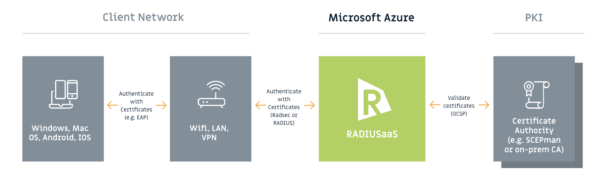

# Welcome


SCEPman version 2.5.982 introduced an extended timestamp format that makes some OCSP responses incompatible with some clients including RADIUSaaS.&#x20;

**This can result in valid certificates being rejected temporarily. In the case of WiFi authentications, clients may need multiple connection attempts.**

The behavior is reverted in [SCEPman version 2.5.985](broken-reference).&#x20;

If you are still using SCEPman 2.5.982, please stop and start your App Service [to enforce an update](https://docs.scepman.com/advanced-configuration/update-strategy#evergreen-approach), preferably outside of peak usage.


RADIUSaaS offers easy and secure authentication for accessing network resources. It delivers the comfort, reliability, and scalability of a native cloud SaaS. Supported protocols are RADIUS as well as RadSec. Authentication is based on certificates. RADIUSaaS is generally capable of validating every certificate that can be used for client authentication. However, to be able to lock someone with a revoked certificate out of your network, choose a CA which provides a publicly accessible OCSP endpoint. RADIUSaaS automatically generates XML configuration files for WiFi and LAN profiles.


RADIUSaaS Overview & Architecture


These docs cover technical aspects of RADIUSaaS. All other information can be found on [https://radius-as-a-service.com/](https://radius-as-a-service.com/).
