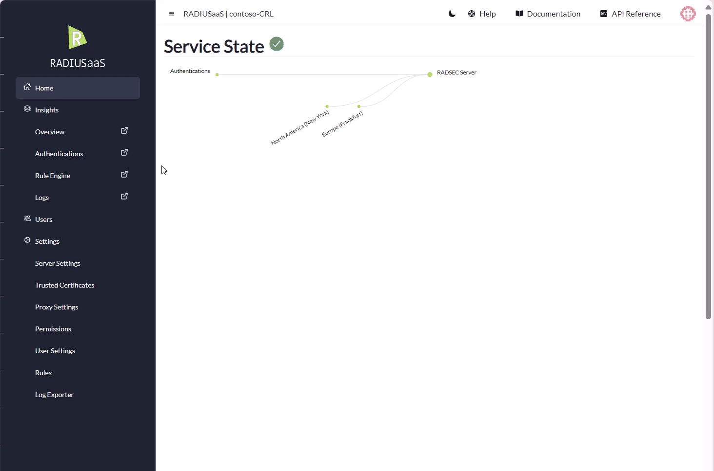
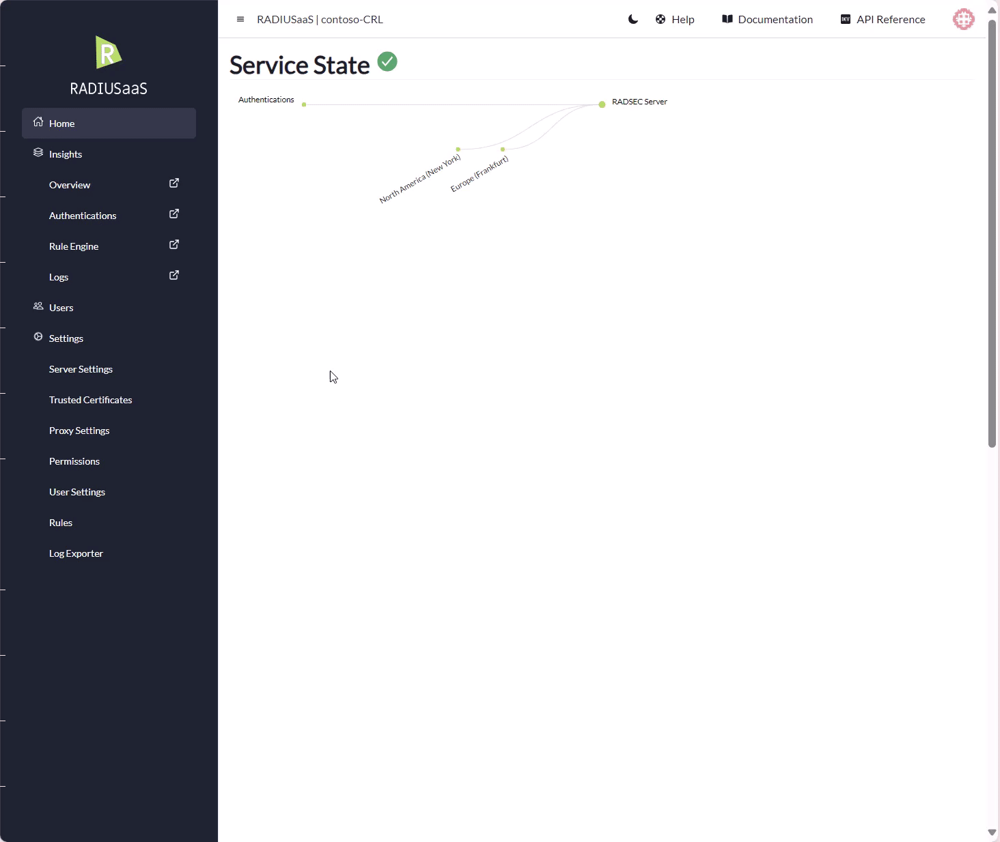
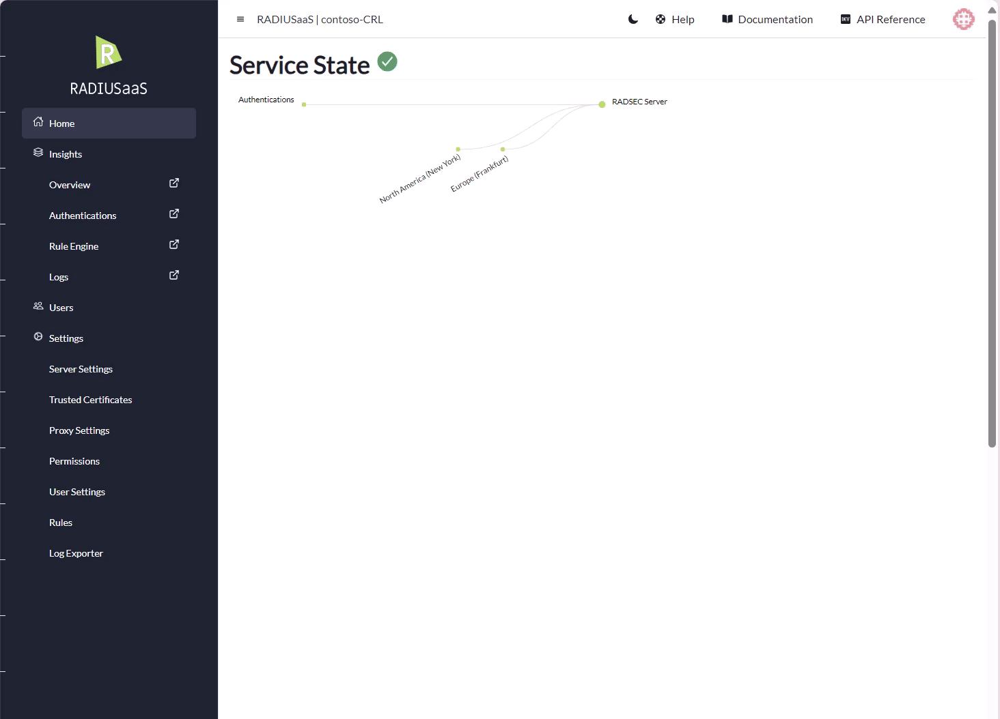

# Users

## General


RADIUSaaS **does not provide** any **integration** with Identity Providers (IDPs) for username/password-based network authentication. All username/password accounts used for network authentication with RADIUSaaS must be managed on the RADIUSaaS Admin Portal.


RADIUSaaS offers username/password-based authentication as an **alternative** to certificate-based authentication whenever the usage of certificates is technically hard to reach or not feasible. Such scenarios may include:

* Bring your own Device (BYOD)
* [Guest Access ](../byod-and-guest-access/my-invited-users.md)
* Devices lacking EAP-TLS support for 802.1X (e.g. printers, TVs, ...)

## Protocols

Devices that use username and password for network authentication have to speak one of the following Protocols:&#x20;

* EAP-TTLS-PAP
* EAP-TTLS-MSCHAPv2
* PEAP-MSCHAPv2

## Add

To **Add** a new User, click **Add** and provide **User Name** and **Password** and choose your **Validity**. After entering all details, click **Create**.

<figure><figcaption>
Showing adding a new user
</figcaption></figure>

## CSV Import

To import your users from a CSV file

* Click on **Import(CSV)**

<figure><figcaption>
Showing user import button
</figcaption></figure>

* A pop-up appears, from where you're able to upload your CSV file.&#x20;
* Once uploaded, the pop-up displays an interactive table mirroring the content of the CSV file
* In this table, you are able to manually override values at your discretion
* Click **Create** to import the User accounts.


The required columns are **Username, Password** and **Owner**



RADIUSaaS does not consider the **Username** a unique property. This means two or more **identical User** accounts may exist. Hence, if an error occurs while uploading the CSV file and users have already been created during the partial upload, please delete those users before uploading the CSV again to prevent duplicates.



## Delete

<figure><figcaption>
Showing importing users from CSV file
</figcaption></figure>

To **Delete** users, select all users which should be deleted in the list, click **Delete and** confirm your choice.

<figure><figcaption>
Showing deletion of user
</figcaption></figure>

## Update

To change a user's password, disable/re-enable a user or select a new validity period, simply click on the **eye** symbol next to the user entry, change all needed entries and save them.

<figure><figcaption>
Showing update of a user
</figcaption></figure>
