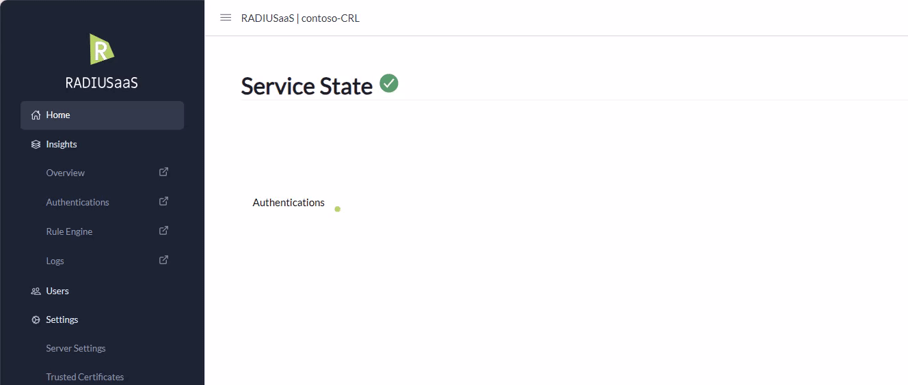
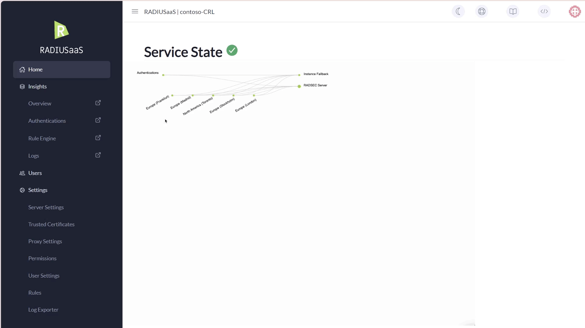

# Home

## Login Screen

You are presented with the login screen when you open your RADIUSaaS Admin Portal for the first time or when your access token has expired. The login screen provides an easily accessible option to download the CA certificate that has signed your [RADIUS Server Certificate](settings/settings-server.md#server-certificates). This feature is particularly useful for bring-your-own-device (BYOD) setups and administrators who need to create network profiles on their devices.

<figure><figcaption></figcaption></figure>

## Service State

The RADIUSaaS homepage presents you with an interactive service state that is **updated in** **real-time**.

### Health State

When you access the homepage of your RADIUSaaS instance, the health state of the service including its key components, i.e. RADIUS proxies and RadSec servers (the core service), is illustrated. The availability of the individual components is monitored in **real-time** and realized through **actual authentications** (PAP-based) that are periodically performed.  By hovering over individual nodes, additional information such as the public IP address and the data center location is shown.

<figure><figcaption>
RADIUSaaS Health State - Overview
</figcaption></figure>

In case, a node is detected to be malfunctioning, the corresponding node along with the no longer available authentication and communication path is highlighted in red:

<figure><figcaption></figcaption></figure>

**Important:** As long as there is at least one green path leading to **Authentications**, the service is generally available. In case you are using RADIUS proxies, ensure that you have followed our architectural [recommendations](settings/settings-proxy.md) to decrease the likelihood that a proxy failure leads to an overall outage of the service.&#x20;

The **Service State** icon in addition to a healthy (green) state can indicate one of three error conditions.&#x20;

| Disabled                                                                      | Removed                                                                       | Expired / Not Yet Valid                                                       |
| ----------------------------------------------------------------------------- | ----------------------------------------------------------------------------- | ----------------------------------------------------------------------------- |
|  |  |  |

### Configuration State

The configuration of your RADIUSaaS instance may at times be rather complex, especially in cases where the [Rule Engine](insights/rule-engine.md) is heavily used. To still provide you with an easy overview, RADIUSaaS offers a tree view of all active configurations. The view can be reached by clicking on the **Authentications** node in the Health State view. A tree view of all configured rules will unfold.

On the first layer of the tree, the network types are presented (WiFi, Wired, VPN). On subsequent layers the structure and configuration of the rules is shown, including permitted authentication types (certificate-based, username/password-based), trusted CAs, allow-listed APs/switches and SSIDs, and finally RADIUS return attributes such as VLAN- or other tags - if any. Grayed-out rules are disabled and thus will lead to rejected authentications in case none of the active/green rule-paths are fulfilled for a particular network type during authentication.&#x20;

<figure><figcaption>
Interactive RADIUSaaS Configuration State
</figcaption></figure>

## Other controls

The RADIUSaaS homepage gives you easy access to frequently used controls and information.

<figure><figcaption></figcaption></figure>

### Dark Mode

Click on the UI-mode button to toggle between dark and normal mode.

<figure><figcaption></figcaption></figure>

### Notifications

You can find notifications regarding your service in here.

<figure><figcaption></figcaption></figure>

### Help


RADIUSaaS considers the UPN of the person submitting the support request the primary contact. In case your UPN is not linked to a mailbox or you would like to include other recipients in the ticket, leverage the **Additional Recipients** list.


Click on the life saver button to lodge a support request.

<figure><figcaption></figcaption></figure>

<figure><figcaption></figcaption></figure>

### Service Documentation

A direct link to the RADIUSaaS documentation.

<figure><figcaption></figcaption></figure>

### API Documentation

A direct link the RADIUSaaS REST API Swagger documentation.

<figure><figcaption></figcaption></figure>


[rest-api](../other/rest-api/)

