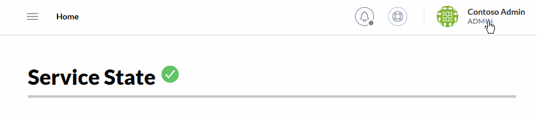
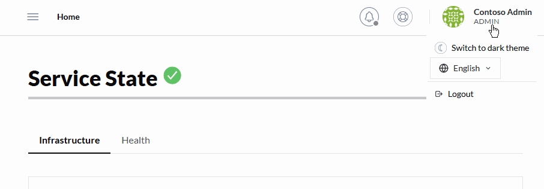

# Home

## Login Screen

You are presented with the login screen when you open your RADIUSaaS Admin Portal for the first time or when your access token has expired. The login screen provides an easily accessible option to download the CA certificate that has signed your [RADIUS Server Certificate](settings/settings-server.md#server-certificates). This feature is particularly useful for bring-your-own-device (BYOD) setups and administrators who need to create network profiles on their devices.

<figure><figcaption></figcaption></figure>

## Service State

The RADIUSaaS homepage presents you with an interactive service state that is **updated in** **real-time**.

### Infrastructure

When you access the homepage of your RADIUSaaS instance, the Infrastructure tab displays the RADIUSaaS instance's key components, including the RadSec Server and RADIUS proxies. The availability of the individual components is monitored in **real-time** and realized through **actual authentications** (PAP-based) that are periodically performed.  By hovering over individual nodes, additional information such as the public IP address and the data center location is shown.

<figure><figcaption></figcaption></figure>

In case, a node is detected to be malfunctioning, the corresponding node along with the unavailable authentication and communication path is highlighted in red:

<figure><figcaption></figcaption></figure>

**Important:** As long as there is at least one green path leading to **Authentications**, the service is generally available. In case you are using RADIUS proxies, ensure that you have followed our architectural [recommendations](settings/settings-proxy.md) to decrease the likelihood that a proxy failure leads to an overall outage of the service.&#x20;

The **Service State** icon in addition to a healthy (green) state can indicate one of three error conditions.&#x20;

| Disabled                                                                   | Removed                                                                    | Expired / Not Yet Valid                                                    |
| -------------------------------------------------------------------------- | -------------------------------------------------------------------------- | -------------------------------------------------------------------------- |
|  |  |  |

### Health

The Health tab displays the health status of all components relevant to your RADIUSaaS instance, including certificates and the optional SCEPman-aaS module.

<figure><figcaption></figcaption></figure>

## Other controls

The RADIUSaaS homepage gives you easy access to frequently used controls and information.

<figure><figcaption></figcaption></figure>

### Notifications

You can find notifications (alerts, configuration improvement notifications, important announcements) regarding your service in here.

<figure><figcaption></figcaption></figure>

### Help

Click on the life saver button to lodge a support request.

<figure><figcaption></figcaption></figure>

<figure><figcaption></figcaption></figure>

### Dark Mode

Click on the User Account button, followed by "Switch to dark/light theme" to toggle between dark and light mode.

<figure><figcaption></figcaption></figure>

### Language

The RADIUSaaS Portal is available in German, English, Spanish, French, Japanese and Portuguese.

<figure><figcaption></figcaption></figure>

### Service Documentation

A direct link to the RADIUSaaS documentation.

<figure><figcaption></figcaption></figure>

### API Documentation

A direct link the RADIUSaaS REST API Swagger documentation.

<figure><figcaption></figcaption></figure>


[rest-api](../other/rest-api/)

