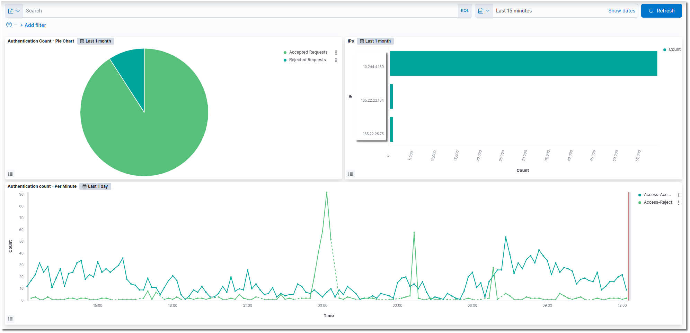

# Insights

### Dashboards

In your Overview you have a short overview about the status for the logged in users over the day.&#x20;

### Authentications

Under Authentications you have tables to get an overview on how many times someone has been logged in and an overview about why authentications are failing.&#x20;

.png>)

### Creating Custom Visualisation

The clip below shows how you can modify or replace a widget to better suit your needs. For example, the current IPs widget can only display 30 IPs, whereas your environment requires 100.


Please note that the default visualization will be reset due to instance maintenance. Therefore, we recommend creating an additional visualization for your purposes.


<figure><figcaption></figcaption></figure>
