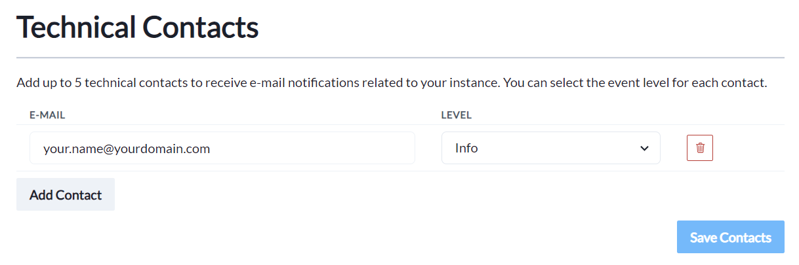
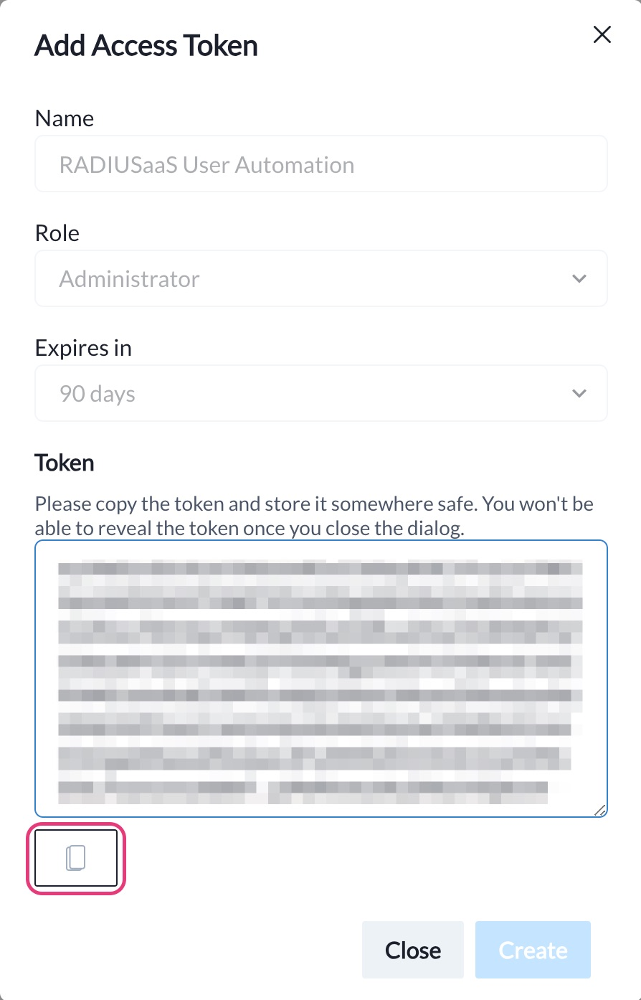

# Permissions

## Overview

The **Permissions** menu allows you to control access to the RADIUSaaS Admin Portal and the RADIUSaaS REST API.


RADIUSaaS leverages Microsoft Entra ID (Azure AD) as identity provider for the authentication when logging on to the RADIUSaaS Admin Portal.&#x20;

RADIUSaaS does not store or manage its own administrator identities. The authentication is delegated to the corresponding Microsoft Entra ID (Azure AD) tenant of the provided UPN (SSO).

Therefore, administrators enjoy the comfort of working with their own Microsoft Entra ID (Azure AD) accounts and do not have to setup additional accounts. All applicable Conditional Access (CA) policies are enforced.


<figure><figcaption></figcaption></figure>


Changes to the role assignments and invalidating user tokens only become effective after clicking on **Save**.


## Roles

### Administrators

Microsoft Entra ID (Azure AD) UPNs entered here can access the RADIUSaaS Admin Portal and **full read and write permissions** on the service. These permissions include:&#x20;

* View [dashboards and Logs](../insights/)
* View, add, change, delete [Users](../users.md)
* View, add, change, delete [RADIUS server certificates](settings-server.md#server-certificates) and [trusted certificates](trusted-roots.md) for client authentication and RadSec
* View, add, delete [Proxies](settings-proxy.md)
* View and change others settings including permissions
* Manage [RADIUSaaS REST API Access Token](permissions.md#access-tokens)
* Access to all [API endpoints](../../other/rest-api.md) and CRUD operations

### Viewers

Microsoft Entra ID (Azure AD) UPNs entered here can access the RADIUSaaS Admin Portal and **full read permissions** on the service. These permissions include:&#x20;

* View [dashboards and Logs](../insights/)
* View [Users](../users.md)
* View, add, change, delete [RADIUS server certificates](settings-server.md#server-certificates) and [trusted certificates](trusted-roots.md) for client authentication and RadSec
* View [Proxies](settings-proxy.md)
* View others settings (permission cannot be viewed)
* Access to all [API endpoints](../../other/rest-api.md) - **limited to read operations**

### Users

Microsoft Entra ID (Azure AD) UPNs entered here can access the RADIUSaaS Admin Portal but can **only access the** [**Users portal**](../../byod-and-guest-access/my-invited-users.md), where they are able to create [Users](../users.md) for BYOD or guest access.

### Invalidate user tokens

During authentication to the RADIUSaaS Admin Portal, each permitted Microsoft Entra ID (Azure AD) account obtains an access (bearer) token that is cached in the browser's cookie store. The lifetime of the token is 30 days. Furthermore, RADIUSaaS has permission to refresh these access tokens.

In a security event, RADIUSaaS Administrators can **invalidate all previously issued access tokens** by setting the minimum issuance date to now.&#x20;

<figure><figcaption></figcaption></figure>

## Technical Contacts


Please note that this feature is in preparation for a notification feature in a future release of RADIUSaaS.


Add up to 5 technical contacts to receive e-mail notifications related to your instance. You can select the event level for each contact.

<table><thead><tr><th width="137">Event level</th><th>Example events</th></tr></thead><tbody><tr><td>Info</td><td>Scheduled updates to your instance.</td></tr><tr><td>Warning</td><td>A certificate is about to expire, or an ISP is experiencing issues that could impact your instance.</td></tr><tr><td>Critical</td><td>Interruption to your instance. </td></tr></tbody></table>

<figure><figcaption></figcaption></figure>

## Access Tokens

Access tokens are required to authenticate calls to the [RADIUSaaS REST API](../../other/rest-api.md).

<figure><figcaption></figcaption></figure>

### Add

Follow these steps to create a new access token:

1. Click on **Add**
2. Provide a meaningful **Name** for the access token
3. Set the permission level by selecting a [**Role**](permissions.md#roles)
4. Select the lifetime of the access token
5. Click on **Create**\
   .png>)\

6. Copy the access token to the clipboard and store it at a secure location.\
   
7. Click on **Close**

### **Delete**

To delete an access token, locate it in the table and click on the bin icon:

<figure><figcaption></figcaption></figure>

## Permissions consent

Microsoft Entra ID (Azure AD) accounts that log on to the RADIUSaaS Admin Portal for the first time must grant RADIUSaaS a limited set of [permissions in their Azure tenant](../../other/faqs/security-and-privacy.md#id-5.-which-tenant-permissions-do-users-accessing-the-radiusaas-web-portal-have-to-consent-to).

There are two alternative ways to provide consent:

* **User Consent**\
  Each user accepts the consent upon first login to the portal.
* **Admin Consent**\
  An administrator can consent on behalf of the organization for all users.

### User consent

If no consent has been given on behalf of the organization before by an admin, a user will see a permission request dialogue:

<figure><figcaption></figcaption></figure>

Users can review or revoke this consent in Microsoft [My Apps](https://myapps.microsoft.com).

<figure><figcaption></figcaption></figure>

Administrators can review & revoke user consents in the Azure Portal (**Microsoft Entra ID** > **Enterprise Applications** > **RADIUS as a Service**):

<figure><figcaption></figcaption></figure>

### Admin consent

Rather than requiring consent from each user, administrators can grant consent for all users on behalf of the organization, when logging in the RADIUSaaS web portal for the first time:

<figure><figcaption></figcaption></figure>

Alternatively, administrators can grant the consent on behalf of the organization in the Azure portal (**Microsoft Entra ID** > **Enterprise Applications** > **RADIUS as a Service**). In Azure Portal, administrators can also review or revoke the consent:

<figure><figcaption></figcaption></figure>

