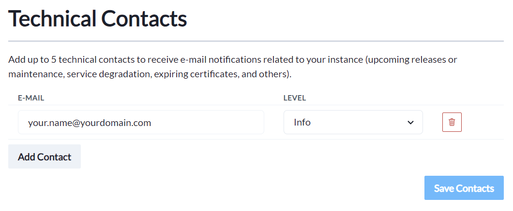

# Permissions

## Overview

The **Permissions** menu allows you to control access to the RADIUSaaS Admin Portal and the RADIUSaaS REST API.


RADIUSaaS supports multiple IDPs for the authentication when logging on to the RADIUSaaS Admin Portal.

RADIUSaaS does not store or manage its own administrator identities.

Therefore, administrators enjoy the comfort of working with their own identities and do not have to setup additional accounts.


<figure><figcaption></figcaption></figure>


Changes to the role assignments and invalidating user tokens only become effective after clicking on **Save**.


## Supported IDPs

Under **Allowed Authentication Providers** any (including multiple) of the IDPs RADIUSaaS supports can be enabled:

* Apple (Apple ID)&#x20;
* DigitalOcean (User Email Address)
* Entra ID (User Principal Name)
* Google (Primary Email Address)

Furthermore, under **Custom OICD Provider** you may configure your own OpenID Connect providers to leverage other IDPs, e.g. Okta or sovereign Azure clouds (GCC, GCC High, ...).

## Roles

### Administrators

Identities or accounts entered here can access the RADIUSaaS Admin Portal with **full read and write permissions** on the service. These permissions include:&#x20;

* View [dashboards and Logs](../insights/)
* View, add, change, delete [Users](../users.md)
* View, add, change, delete [RADIUS server certificates](settings-server.md#server-certificates) and [trusted certificates](trusted-roots.md) for client authentication and RadSec
* View, add, delete [Proxies](settings-proxy.md)
* View and change others settings including permissions
* Manage [RADIUSaaS REST API Access Token](permissions.md#access-tokens)
* Access to all [API endpoints](../../other/rest-api/) and CRUD operations

### Viewers

Identities or accounts entered here can access the RADIUSaaS Admin Portal with **full read permissions** on the service. These permissions include:&#x20;

* View [dashboards and Logs](../insights/)
* View [Users](../users.md)
* View, add, change, delete [RADIUS server certificates](settings-server.md#server-certificates) and [trusted certificates](trusted-roots.md) for client authentication and RadSec
* View [Proxies](settings-proxy.md)
* View others settings (permission cannot be viewed)
* Access to all [API endpoints](../../other/rest-api/) - **limited to read operations**

### Users

Identities or accounts entered here **cannot** access the RADIUSaaS Admin Portal, however, they can access the [**My Invited Users**](../my-invited-users.md) portal, where they are able to create [Users](../users.md) for BYOD or guest access.

### Invalidate user tokens

During authentication to the RADIUSaaS Admin Portal, each permitted identity obtains an access (bearer) token that is cached in the browser's cookie store. The lifetime of the token is 30 days. Furthermore, RADIUSaaS has permission to refresh these access tokens.

In a security event, RADIUSaaS Administrators can **invalidate all previously issued access tokens** by setting the minimum issuance date to now.&#x20;

<figure><figcaption></figcaption></figure>

## Technical Contacts


Please note that this feature is in preparation for a notification feature in a future release of RADIUSaaS.


Add up to 5 technical contacts to receive e-mail notifications related to your instance. You can select the event level for each contact.

<table><thead><tr><th width="137">Event level</th><th>Example events</th></tr></thead><tbody><tr><td>Info</td><td>Scheduled updates to your instance.</td></tr><tr><td>Warning</td><td>A certificate is about to expire, or an ISP is experiencing issues that could impact your instance.</td></tr><tr><td>Critical</td><td>Interruption to your instance. </td></tr></tbody></table>

<figure><figcaption></figcaption></figure>

## Access Tokens

Access tokens are required to authenticate calls to the [RADIUSaaS REST API](../../other/rest-api/).

<figure><figcaption></figcaption></figure>

### Add

Follow these steps to create a new access token:

1. Click on **Add**
2. Provide a meaningful **Name** for the access token
3. Set the permission level by selecting a [**Role**](permissions.md#roles)
4. Select the lifetime of the access token
5. Click on **Create**\
   .png>)\

6. Copy the access token to the clipboard and store it at a secure location.\
   
7. Click on **Close**

### **Delete**

To delete an access token, locate it in the table and click on the bin icon:

<figure><figcaption></figcaption></figure>

## Permissions consent

Choose from different identity providers to be able to log into your portal.




Microsoft Entra ID (Azure AD) accounts that log on to the RADIUSaaS Admin Portal for the first time must grant RADIUSaaS a limited set of [permissions in their Azure tenant](../../other/faqs/security-and-privacy/#id-5.-which-tenant-permissions-do-users-accessing-the-radiusaas-web-portal-have-to-consent-to).

There are two alternative ways to provide consent:

* **User Consent**\
  Each user accepts the consent upon first login to the portal.
* **Admin Consent**\
  An administrator can consent on behalf of the organization for all users.

### User consent

If no consent has been given on behalf of the organization before by an admin, a user will see a permission request dialogue:

<figure><figcaption></figcaption></figure>

Users can review or revoke this consent in Microsoft [My Apps](https://myapps.microsoft.com).

<figure><figcaption></figcaption></figure>

Administrators can review & revoke user consents in the Azure Portal (**Microsoft Entra ID** > **Enterprise Applications** > **RADIUS as a Service**):

<figure><figcaption></figcaption></figure>

### Admin consent

Rather than requiring consent from each user, administrators can grant consent for all users on behalf of the organization, when logging in the RADIUSaaS web portal for the first time:

<figure><figcaption></figcaption></figure>

Alternatively, administrators can grant the consent on behalf of the organization in the Azure portal (**Microsoft Entra ID** > **Enterprise Applications** > **RADIUS as a Service**). In Azure Portal, administrators can also review or revoke the consent:

<figure><figcaption></figcaption></figure>



When using an Apple ID to log into RADIUSaaS, make sure to **not hide** your email address.

<figure><figcaption></figcaption></figure>


If you chose to hide your email in this dialog you will not be able to log into your portal. You will then need to remove the RADIUSaaS app on **account.apple.com** in the **Sign in with Apple** section




Digital Ocean will require you to authorize the application on a team to be able to login:

<figure><figcaption></figcaption></figure>



Google will require you to allow the application to access limited data on your account.

<figure><figcaption></figcaption></figure>



The specific information you need to provide for the custom OIDC provider depends on the identity provider you choose. The following **example** is based on **Okta**.

<figure><figcaption></figcaption></figure>

In the Okta admin console, you will need to create a new app integration with the following details:

| Sign-in method       | OIDC - OpenID Connect                                                                                                                                                                           |
| -------------------- | ----------------------------------------------------------------------------------------------------------------------------------------------------------------------------------------------- |
| Application Type     | Web Application                                                                                                                                                                                 |
| Sign-in redirect URI | 
Provided in RADIUSaaS dialogue above Example: <a href="https://eu1.radius-as-a-service.com/loginserver/authResponse">https://eu1.radius-as-a-service.com/loginserver/authResponse</a>
 |

Make sure to assign the integration to the intended user group and save. You can now retrieve the required information from this application to enter in RADIUSaaS:

The **Display Name** can be chosen freely and will be shown during login.

With Okta, the **Authentication URL** is in the following form:

`https://`**`{YourOrga}`**`.okta.com/oauth2/v1/authorize`

The Token URL is also constructed and looks like this:

`https://`**`{YourOrga}`**`.okta.com/oauth2/v1/token`

The **Client ID** and **Client Secret** can be copied and created in the application itself:

<figure><figcaption></figcaption></figure>

For the **Client Scope** `openid email` is required. This will tell Okta that we are using an OpenID authentication and need to read the logged in users email address.

After saving and allowing this provider, you should be able to use it to authenticate from the login page:

<figure><figcaption></figcaption></figure>



If required in certain scenarios (e.g. **GCC High** tenants), you can also use a self-created Entra ID app registration to authenticate to your RADIUSaaS portal.

#### Preparation

Before creating the app registration, make sure to copy the redirect URL from the **Permissions** section of your RADIUSaaS portal. You can find the URL in the top of the **Custom OIDC Provider** editing dialogue:

<figure><figcaption></figcaption></figure>

<figure><figcaption></figcaption></figure>

### Create App Registration

In Entra ID, navigate to **App Registrations** and create a new registration:

<figure><figcaption></figcaption></figure>

Select a descriptive **Name** for the registration and add the redirect URI that you have copied from the previous step as **Web** type.

#### Add API Permissions

In the created registration, navigate to **API permissions** and add `email` and `openid` from Microsoft Graph as **Delegated** permissions. Also make sure to grant admin consent for your tenant:

<figure><figcaption></figcaption></figure>

#### Add Client Secret

To allow RADIUSaaS to use this registration, create a client secret in the **Certificates & Secrets** section of the registration. Copy the value of the secret for later.

<figure><figcaption></figcaption></figure>

#### Note Registration Details

You will later need the registrations **Client ID** and some URLs specific to your tenant. You can find these in the Overview page of the registration:

<figure><figcaption></figcaption></figure>

#### Assign Users

For anyone to be able to use this app registration for sign-ins, make sure to add them in the managed enterprise application. You can find this in Entra ID in **Enterprise Applications** having the same name as your app registration. There is also a link to this in the overview of the app registration.

<figure><figcaption></figcaption></figure>

### Configure the OIDC Provider in RADIUSaaS

Back in the RADIUSaaS portal, navigate to the Permissions section and edit the custom OIDC provider and fill in the required information:

<figure><figcaption></figcaption></figure>

| Field              | Explanation                                                                             |
| ------------------ | --------------------------------------------------------------------------------------- |
| Display Name       | This name will be shown on the login page                                               |
| Authentication URL | `OAuth 2.0 authorization endpoint (v2)` from the registrations endpoints                |
| Token URL          | `OAuth 2.0 token endpoint (v2)` from the registrations endpoints                        |
| Client ID          | The client ID of the app registration. Can be found on its overview page                |
| Client Secret      | The previously created client secret                                                    |
| Client Scope       | Defines the information requested during the authentication. Enter `openid email` here. |

After saving the configuration make sure to allow the custom provider and add some users for this provider. You should now be able to use the provider to log into your RADIUSaaS portal:

<figure><figcaption></figcaption></figure>


It might be necessary for an Entra administrator to initially use this login to consent again for their tenant. This only needs to be done once.



