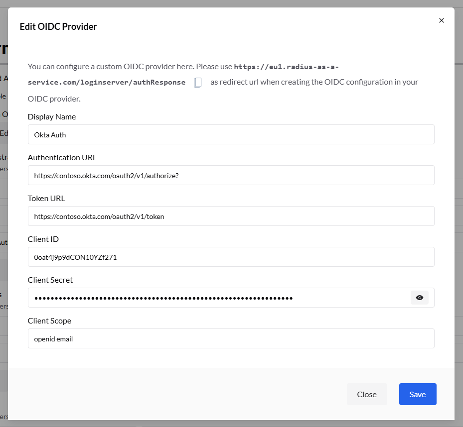

# SCEPman

## SCEPman Identity & Keys

<figure><figcaption></figcaption></figure>

<table data-header-hidden><thead><tr><th width="217.55560302734375"></th><th></th></tr></thead><tbody><tr><td><strong>Common Name</strong></td><td>The SCEPman CA root certificate’s subject name displayed in the UI. This is the identity that will appear in issued certificates (e.g., Trusted Root CA).</td></tr><tr><td><strong>Organization</strong></td><td>Organisation name used in the CA’s distinguished name.</td></tr><tr><td><strong>Use your own Key Vault</strong></td><td>This control allows you to bring an existing Azure Key Vault to store CA keys and secrets securely rather than letting SCEPman generate/manage them.</td></tr></tbody></table>

***

## Tenant Connection

This controls how SCEPman connects/consents with Entra ID:



No tenant OAuth connection configured yet.

<figure><figcaption></figcaption></figure>



Connects SCEPman with Entra ID via a delegated admin consent.

<figure><figcaption></figcaption></figure>



Allows customising your own Entra ID app registration for SCEPman permissions. 

<figure><figcaption></figcaption></figure>



***

## Settings

These settings correspond to configurable SCEPman _environment variables_ that determine how the SCEP server behaves.

<figure><figcaption></figcaption></figure>

| **Remote Debug**               | Enables remote debug logging for support/troubleshooting. [Learn more](https://docs.scepman.com/scepman-configuration/application-settings/basics#appconfig-remotedebug).                                                                                                   |
| ------------------------------ | --------------------------------------------------------------------------------------------------------------------------------------------------------------------------------------------------------------------------------------------------------------------------- |
| **Default Extended Key Usage** | EKU that certificates issued via Certificate Master should include (e.g., ServerAuthentication). This usually influences what purposes issued certs can be used for (e.g., TLS).                                                                                            |
| **Validity Period Days**       | 
Default maximum lifetime of certificates issued via Certificate Master (global maximum 

can be configured separately). <a href="https://docs.scepman.com/scepman-configuration/application-settings/certificates#appconfig-validityperioddays">Learn more</a>.
 |

***

<figure><figcaption></figcaption></figure>

| **CRL**                             | Enables CRL support for your SCEPman instance. [Learn more](https://docs.scepman.com/certificate-management/manage-certificates/enabling-crl).                                                                                                                                                     |
| ----------------------------------- | -------------------------------------------------------------------------------------------------------------------------------------------------------------------------------------------------------------------------------------------------------------------------------------------------- |
| **Intune Validation**               | Enables Intune-specific [OCSP behaviour](https://docs.scepman.com/certificate-management/manage-certificates#automatic-revocation) in SCEPman (multiple related features).                                                                                                                         |
| **Validity Period Days**            | This setting further reduces the global ValidityPeriodDays for the Intune endpoint.                                                                                                                                                                                                                |
| **Compliance Check**                | When SCEPman receives an OCSP request, SCEPman can optionally check the device compliance state. [Learn more](https://docs.scepman.com/scepman-configuration/application-settings/scep-endpoints/intune-validation#appconfig-intunevalidation-compliancecheck).                                    |
| **Compliance Grace Period Minutes** | This setting defines a grace period in minutes during which the device is considered compliant, even if it is not yet. [Learn more](https://docs.scepman.com/scepman-configuration/application-settings/scep-endpoints/intune-validation#appconfig-intunevalidation-compliancegraceperiodminutes). |
| **Device Directory**                | Determines where to look up devices on OCSP requests for device certificates. [Learn more](https://docs.scepman.com/scepman-configuration/application-settings/scep-endpoints/intune-validation#appconfig-intunevalidation-devicedirectory).                                                       |

***

<figure><figcaption></figcaption></figure>

| **Jamf Validation**             | When enabled, SCEPman will expose an endpoint (`/jamf`) that allows Jamf Pro-managed devices to enrol certificates that support [automatic revocation](https://docs.scepman.com/certificate-management/manage-certificates#automatic-revocation). [Learn more](https://docs.scepman.com/scepman-configuration/application-settings/scep-endpoints/jamf-validation). |
| ------------------------------- | ------------------------------------------------------------------------------------------------------------------------------------------------------------------------------------------------------------------------------------------------------------------------------------------------------------------------------------------------------------------- |
| **Static Validation**           | Enables the `/static` SCEP endpoint for non-Intune/Jamf Pro MDM systems. If ruthermore allows issuing certificates to systems that don’t have MDM integration by using a static challenge password. [Learn more](https://docs.scepman.com/scepman-configuration/application-settings/scep-endpoints/static-validation#appconfig-staticvalidation-enabled).          |
| **Default Extended Key Usage**  | OIDs of the extended key usages (EKUs) that are added by default to the certificate if the Jamf Pro or Static endpoint is used. [Learn more](https://docs.scepman.com/scepman-configuration/application-settings/scep-endpoints/jamf-validation#appconfig-jamfvalidation-defaultekus).                                                                              |
| **Request Password**            | A challenge password that Jamf Pro or other MDM systems must include in every SCEP request to acquire a certificate. [Learn more](https://docs.scepman.com/scepman-configuration/application-settings/scep-endpoints/jamf-validation#appconfig-jamfvalidation-requestpassword).                                                                                     |
| **Client ID and Client Secret** | **ClientID** and **ClientSecret** are required to establish a connection to the Jamf Pro backend via its API and are an alternative to APIUsername and APIPassword. [Learn more](https://docs.scepman.com/scepman-configuration/application-settings/scep-endpoints/jamf-validation).                                                                               |
| **Allow Renewals**              | This allows using the _RenewalReq_ operation on this SCEP endpoint. [Learn more](https://docs.scepman.com/scepman-configuration/application-settings/scep-endpoints/static-validation#appconfig-dbcsrvalidation-allowrenewals).                                                                                                                                     |

***

<figure><figcaption></figcaption></figure>

| **Static-AAD Validation** | If enabled, SCEPman will expose an endpoint (`/static/aad`) through which clients managed via MDM systems other than Intune/Jamf Pro can request certificates that are bound to an Entra ID user object, allowing for [automatic revocation](https://docs.scepman.com/certificate-management/manage-certificates#automatic-revocation) of such certificates based on the state/presence of the corresponding Entra ID user object. It requires your MDM to support the sync of user objects from Entra ID. [Learn more](https://docs.scepman.com/scepman-configuration/application-settings/scep-endpoints/staticaad-validation).  |
| ------------------------- | ---------------------------------------------------------------------------------------------------------------------------------------------------------------------------------------------------------------------------------------------------------------------------------------------------------------------------------------------------------------------------------------------------------------------------------------------------------------------------------------------------------------------------------------------------------------------------------------------------------------------------------- |
| **DC Validation**         | When enabled, SCEPman will expose an endpoint (`/dc`) to issue Domain Controller certificates (e.g., Kerberos authentication certs) with a challenge password. [Learn more](https://docs.scepman.com/scepman-configuration/application-settings/scep-endpoints/dc-validation).                                                                                                                                                                                                                                                                                                                                                     |
