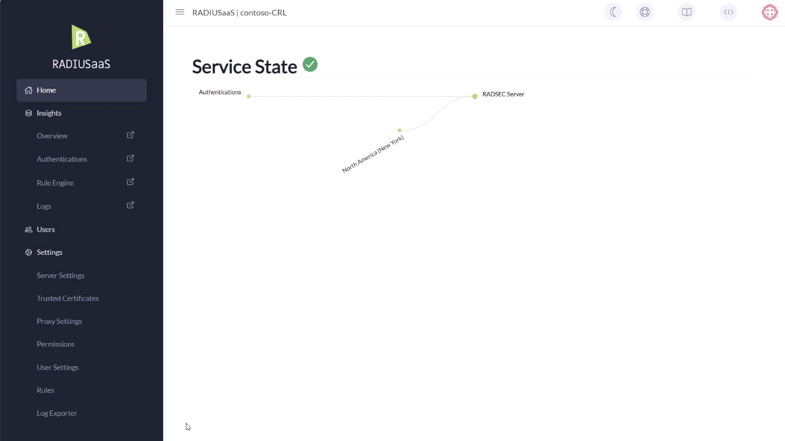

# Proxy Settings

Proxies are necessary in case your authenticators (e.g. APs, switches, ...) only support traditional RADIUS / UDP for AAA. The proxies faciliate the protocol conversion from RADIUS to RadSec so that your equipment can properly communicate with RADIUSaaS core server(s), that exclusively support RadSec / TCP for AAA.

## Architecture


Since there are at least two RADIUS-speaking public IP addresses included in your subscription, we strongly recommend configuring those two IP addresses so they can be used as primary and secondary RADIUS server on your network gear and appliances. Thereby, the second public IP address should be located in a different geo-region than the primary address.


### Performance

Each proxy can handle up to **1,500** **concurrent** connections flawlessly.&#x20;

This corresponds to a time-based performance of **10,000 authentications per minute per proxy**.

### Scaling

We have never never seen any issues if you choose **Europe** as proxy location, no matter where your clients are located. Nonetheless it can increase your performance to choose the Proxy at one location which is as close as possible to your offices and sites.

To ensure smooth operation, consider the following number of proxies based on the number of users you have licensed (your needs may change if your offices are more globally distributed):

|       User       | Proxy Count |
| :--------------: | :---------: |
|    50 - 2,500    |      2      |
|  2,501 - 10,000  |      3      |
|  10,001 - 25,000 |      4      |
|  25,001 - 50,000 |      6      |
| 50,001 - 100,000 |      10     |

### Regions

You can deploy the proxy servers in the following regions:

| Continent     | Region                                            |
| ------------- | ------------------------------------------------- |
| Africa        | Johannesburg                                      |
| Asia          | 
Bangalore Singapore TelAviv Tokio
 |
| Australia     | Sydney                                            |
| Europe        | 
Frankfurt London Madrid Stockholm
 |
| North America | 
Dallas New York Seattle Toronto
   |
| South America | Santiago                                          |

### Load Balancing

If you have a setup with more than 1,000 users, we highly recommend ensuring, that your network equipment will send equal amounts of authentications to each proxy.

For network equipment, where you can define the priority of the RADIUS servers, you can ensure load-balancing by defining different priority orders for your different network equipment instances.

**Example:** You have 5 WiFi controllers and 3 RADIUS Proxies. You may then configure the following priority orders in your WiFi controllers:

<table><thead><tr><th width="196.5">WiFi Controller #</th><th>RADIUS Priority Order</th></tr></thead><tbody><tr><td>1 and 4</td><td>1, 2, 3</td></tr><tr><td>2 and 5</td><td>2, 3, 1</td></tr><tr><td>3</td><td>3, 1, 2</td></tr></tbody></table>

### Failover

When [multiple RadSec endpoints](settings-server.md#failover-and-redundancy) are configured, RADIUSaaS provides an automatic failover mechanism for your RADIUS proxies.&#x20;

In the unlikely event that one or more RadSec endpoints fail, the available proxies will detect the failed state and redirect requests to the (geographically) closest active RadSec endpoint.&#x20;


Please note that this failover does not apply if the RadSec protocol is being used by the Authenticators rather than RADIUS. In that case, failover is provided by the Authenticator as described [here](https://docs.radiusaas.com/admin-portal/settings/settings-server#failover-and-redundancy). &#x20;


### Properties

The IP address, ports and shared secret of the RADIUS Proxies will be displayed under [**Server Settings**](settings-server.md) **>** [**Ports and IP Addresses**](settings-server.md#properties-1).

## Add&#x20;

To Add a new proxy, simply click **Add**, choose your **Region** and click **Create.**&#x20;

<figure><figcaption>
Showing how to create a proxy
</figcaption></figure>

\
After the installation has finished, it can take up to 15 minutes until your proxy has established a connection to your RADIUS server.

<figure><figcaption>
Showing proxy servers
</figcaption></figure>

## Delete

To **Delete** a proxy, simply click **Delete** of corresponding table row and confirm your choice.&#x20;

<figure><figcaption>
Showing deletion of a proxy server
</figcaption></figure>
