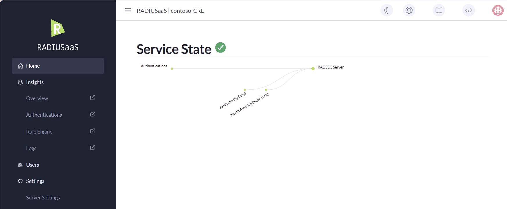
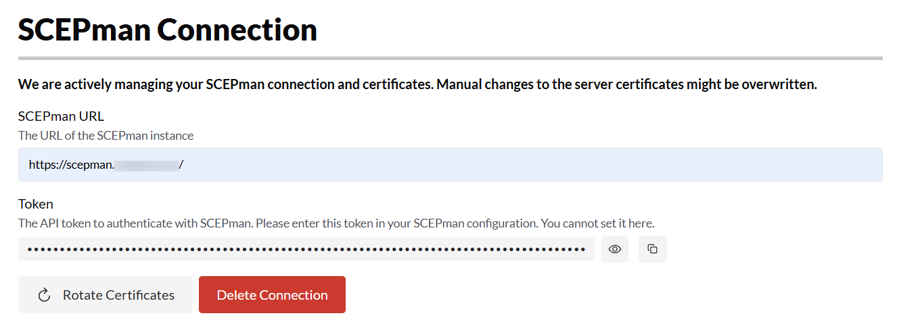

# Server Settings

## Ports & IP Addresses

### Overview

RADIUSaaS operates a RadSec service to provide secure cloud-based authentication for its users. In addition, for those customers who are unable to utilise RadSec in their network environment, e.g. due to hardware and software limitations, RADIUSaaS provides RADIUS Proxies, that handle the protocol conversion from RADIUS to RadSec.&#x20;

Both RadSec and RADIUS service offer public IP address that enable your network appliances and services to communicate with our service from anywhere via the internet. These services operate on their unique registered ports. &#x20;

## RadSec / TCP

<figure><figcaption><p>Showing RadSec IP and port</p></figcaption></figure>

#### **RadSec DNS**

The DNS entry through which the RadSec service can be reached.&#x20;

#### **Server IP Addresses**

This is the public IP address of the RadSec service.

#### **RadSec Ports**

This is the registered port for RadSec: 2083

### Failover & Redundancy

In cases where customers require higher levels of redundancy, multiple RadSec endpoints can be configured for your instance providing an additional IP addresses. Please note that there is an additional cost for this service.

<figure><figcaption><p>Showing two public IP addresses, one for each of the RadSec services.</p></figcaption></figure>


It is important to note that RADIUSaaS **does NOT provide failover** between RadSec endpoints. Instead, this failover is typically implemented on your network equipment as shown in below example using Meraki.&#x20;

It is recommended to configure your failover scenario using IP addresses rather than DNS for better visibility and less reliance on an additional service (DNS).&#x20;


In this configuration, the two RadSec IP addresses are listed in order of preference. When Meraki is unable to reach one of the IP addresses, it will typically try two more times and moves on to the next one. For more information regarding the failover capability of your Meraki (or other) system, please consult your own resources.

<figure><figcaption><p>Showing multiple RadSec servers in order of priority (Meraki).</p></figcaption></figure>

## RadSec Settings


The following settings control certain aspects of the RadSec connection to your RADIUSaaS instance.


### Maximum TLS Version

This setting controls the maximum TLS version for your RadSec interface. The minimum version is fixed at 1.2, the default maximum is set to 1.3.

TLS 1.3 offers several advantages over 1.2, including the post-handshake authentication mechanism, which allows requesting additional credentials before completing the handshake. This is important for the verification checks for RadSec certificates setting discussed next.

### Revocation Check for RadSec Certificates


This setting determines whether a revocation check should be performed for all RadSec connections. The method for verifying the revocation check differs slightly from that used for client authentication certificates.


For proper RadSec operation, network devices such as Access Points, Switches, and VPN Servers establish a TLS-protected connection to the RadSec server. RadSec deployments typically use mutual TLS (mTLS), where both peers authenticate each other using X.509 certificates during the TLS handshake. RADIUSaaS implementation enforces mTLS.&#x20;

To determine the validity and revocation status of a RadSec client certificate, the certificate must be presented by the client as part of the TLS authentication process. Only after the certificate is received can revocation checks (for example, via CRL or OCSP) be performed.

#### **TLS 1.2**

TLS 1.2 supports mutual TLS authentication during the initial handshake using the `CertificateRequest`, `Certificate`, and `CertificateVerify` messages. When client authentication is required and correctly enforced, the RadSec client certificate is presented, validated, and checked for revocation before the TLS session is established and before any RADIUS traffic is exchanged.

\
However, TLS 1.2 also permits optional client authentication and supports renegotiation. As a result, some RadSec client implementations may complete the initial handshake without presenting a client certificate. This behavior is implementation-specific and not a limitation of the TLS 1.2 protocol.&#x20;


To mitigate the above behaviour, the **Revocation Check for RadSec Certificates** setting is deactivated when the maximum TLS version is set to 1.2. Please note you can manually reactive it later.&#x20;


#### **TLS 1.3**

TLS 1.3 provides a more deterministic and streamlined model for mutual TLS authentication. When client authentication is requested, the RadSec client certificate is exchanged as part of the initial handshake and validated before the TLS connection is established.\
This allows the RadSec server to immediately verify the client certificate, including its revocation status, and to fail the handshake if the certificate is invalid or revoked. As a result, TLS 1.3 enables stricter and more predictable enforcement of mutual TLS authentication for RadSec connections.&#x20;


The **Revocation Check for RadSec Certificates** setting is automatically enabled when the maximum TLS version is set to 1.3.


<figure><figcaption></figcaption></figure>

## RADIUS / UDP

This section is available when you have configured at least on [RADIUS Proxy](settings-proxy.md). For each proxy, a separate public IP address is available. The public IP addresses in this section support the RADIUS protocol only and thus listen on ports 1812/1813.

<figure><figcaption></figcaption></figure>

### **Server IP Addresses and Location**


These IP addresses only listen on [RADIUS](../../details.md#what-is-radius) over UDP ports 1812/1813.


Geo-location of the RADIUS Proxy/Proxies as well as the respective public IP address(es).

### **Shared Secrets**

The shared secret for the respective RADIUS Proxy. By default, all RADIUS Proxies are initialized with the same shared secret.

<figure><figcaption><p>Showing changing of shared secrets per proxy</p></figcaption></figure>

### **Ports**

This section displays the standard ports for the RADIUS authentication (1812) and RADIUS accounting (1813) services.

### **Failover & Redundancy**

#### Proxy Redundancy

Note that a single RADIUSaaS Proxy does not provide redundancy. To ensure redundancy, set up multiple RADIUSaaS Proxies as described [here](settings-proxy.md#load-balancing).

#### RadSec Service Redundancy for Proxies

When using RADIUSaaS with multiple RadSec instances, Proxies are automatically configured to connect to all available RadSec instances. A RADIUSaaS Proxy will prioritize connecting to the nearest regional RadSec Service. If that service is unavailable, it will switch to another available RadSec Service.&#x20;

## Server Certificates

### Customer-CA

By default, RADIUSaaS generates a **RADIUS Server Certificate** signed by a Certificate Authority (CA) that is available on our service solely for this very purpose. We refer to it as the **Customer-CA**. The Customer-CA is unique for each customer.

To create your Customer-CA, follow these simple steps:&#x20;

1. Navigate to **Settings** > **Server Settings**
2. Click **Add**
3. Choose **Let RaaS create a CA for you**
4. Click on **Save**
5. After the creation, you will see a new certificate available under Server Certificates

<figure><figcaption></figcaption></figure>

### Bring your own certificate

In case you do not want to use the **Customer CA**, you can upload up to two of your own certificates.

#### SCEPman-issued server certificate

Please follow these steps to leverage SCEPman Certificate Master to generate a new server certificate:

1. Navigate to your SCEPman Certificate Master web portal.
2. Select Request Certificate on the left
3. Select **(Web) Server** on the top
4. Select **Form**
5. Enter all Subject Alternative Names (SANs) that the certificate shall be valid for separated by commas, semicolons, or line breaks. Generate a server certificate as described [here](https://docs.scepman.com/certificate-deployment/certificate-master/tls-server-certificate-pkcs-12) and provide any FQDN you want. We recommend adapting the SAN of the default server certificate, e.g. `radsec-<your RADIUSaaS instance name>.radius-as-a-service.com`.
6. Set the **Download file format** to **PEM**&#x20;
7. Select **Include Certificate Chain** and download the certificate.&#x20;
8. **Submit** the request to download the new server certificate.


**Important**: Take temporary note of the password since it cannot be recovered from Certificate Master.


<figure><figcaption><p>Create a new server certificate</p></figcaption></figure>

### Upload the new server certificate to **RADIUSaaS**

To add your server certificate created in above steps, navigate to **RADIUSaaS instance** > **Settings** > **Server Settings** > **Add** then

8. Choose **PEM or PKCS#12 encoded Certificate** (If you selected PKCS#12 in step 5, this contains both public and private key)
9. Drag & drop your certificate file or click to browse for it
10. Enter the password of your **Private Key**&#x20;
11. Click **Save**

<figure><figcaption></figcaption></figure>


Please note: By default, SCEPman Certificate Master issues certificates that are valid for 730 days. If you'd like to change this, please refer to SCEPman's [documentation](https://docs.scepman.com/advanced-configuration/application-settings/certificates#appconfig-validityperioddays).


### Certificate activation


Ensure to monitor the expiry of your server certificate and renew it in due time to prevent service interruptions.


As certificates expire from time to time or your preference on which certificates you would like to use change, it is important that you can control the certificate that your server is using. The **Active** column shows you the certificate your server is currently using. To change the certificate your server is using, expand the row of the certificate you would like to choose and click **Activate**.&#x20;

### Download

To download your **Server Certificate,** you have two options:&#x20;

1. Click **Download CA Certificate** on the top. This will directly download the **trusted root CA** of the currently **active** server certificate. &#x20;
2. &#x20;Click the **download** icon in the corresponding row.

<figure><figcaption></figcaption></figure>

**Option 2** will open a dialog showing the complete certificate path. The **root certificate** will always be marked in green.

<figure><figcaption><p>Showing the root certificate in green</p></figcaption></figure>

For both options, the downloaded root certificate is encoded in base64 (PEM). In case your device (e.g. WiFi controller) needs a binary coding (DER), you can convert it using [OpenSSL](https://openssl.org/):

```sh
openssl x509 -inform pem -in <DOWNLOADED_FILE> -outform der -out <CONVERTED_FILE>
```

### Delete

To delete a certificate, expand the corresponding row, click **Delete** and confirm your choice.&#x20;

### Certificate Expiration


Do not let the RADIUS Server Certificate expire. It will break the authentication.


Certificates expire from time to time. Five months before your certificate is going to expire, your dashboard will give you a hint by displaying a warning sign next to it.

.png>)

If the triangle is displayed next to the active RADIUS Server Certificate, follow this guide to update it:&#x20;


[renew-certificate.md](../../configuration/renew-certificate.md)


## SCEPman Connection

The SCEPman Connection setting is designed to connect your RaaS instance to your SCEPman instance directly. When you configure this connection RaaS will perform the following task:

1. Create and activate a new Server Certificate
2. It will manage this Server certificate including the renewal process.

<figure><figcaption></figcaption></figure>

#### To establish this connection, follow these steps:

1. Copy the API token shown.
2. Navigate to your SCEPman App Service as per [this](https://docs.scepman.com/scepman-configuration/application-settings#convenient-configuration-in-the-app-service-configuration) guide and create a new environment variable called [AppConfig:RADIUSaaSValidation:Token](https://docs.scepman.com/scepman-configuration/application-settings/scep-endpoints/radiusaas) using the previously copied Token as a value.
3. Apply your settings and Restart your App Service.&#x20;
4. &#x20;Enter the URL of your SCEPman instance in the SCEPman URL field.

<figure><figcaption></figcaption></figure>

5. Click **Setup Connection** and be sure to understand what this will deactivate your current Server Certificate in order to manage the newly created one.&#x20;
6. Once the set up completed, you will see two new buttons replacing the previous ones.&#x20;

<figure><figcaption></figcaption></figure>

1. **Rotate Certificate**. This button will rotate and activate your server certificate between the available two slots. _Servercertificate-**upload0**_ and _Servercertificate-**upload1**_.
2. **Delete Connection.** This button will delete your previously configured connection. Please note that this action cannot be undone. When you delete the connection, the token will also be deleted. Should you wish to set up the connection at a later time, you will need to go through the above steps.
