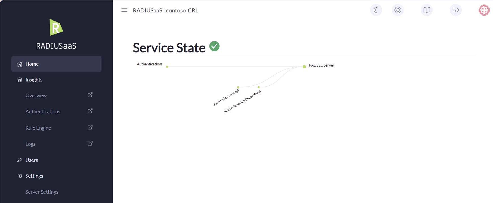

# Server Settings

## Ports & IP Addresses

### Overview

RADIUSaaS provides public IP addresses that allow your network appliances and services to communicate with our service from anywhere via the internet. Thereby, we offer two types of IP addresses that support different protocols and listen on different ports.

### RadSec / TCP

<figure><figcaption><p>Showing RadSec IP and port</p></figcaption></figure>

#### Properties

**RadSec DNS**

The DNS entry through which the RadSec service can be reached.&#x20;

**Server IP Addresses**


These IP addresses only speak [RadSec](../../details.md#what-is-radsec) over TCP port 2083.


Public IP address(s) on which the RadSec service is available.&#x20;

A second IP address is shown if we have configured a secondary RADIUSaaS instance for you.

**RadSec Ports**

This section displays the (standard) port for the RadSec.

### RADIUS / UDP

This section is available when you have configured at least on [RADIUS Proxy](settings-proxy.md). For each proxy, a separate public IP address is available. The public IP addresses in this section support the RADIUS protocol only and thus listen on ports 1812/1813.

<figure><figcaption><p>Showing RADIUS proxy IP and ports</p></figcaption></figure>

#### Properties

**Server IP Addresses and Location**


These IP addresses only speak [RADIUS](../../details.md#what-is-radius) over UDP ports 1812/1813!


Geo-location of the RADIUS proxy/proxies as well as the respective public IP address(es).

**Shared Secrets**

The shared secret for the respective RADIUS proxy. By default, all RADIUS proxies are initialized with the same shared secret.

<figure><figcaption><p>Showing changing of shared secrets per proxy</p></figcaption></figure>

**Ports**

This section displays the standard ports for the RADIUS authentication (1812) and RADIUS accounting (1813) services.

## RadSec Settings


The following settings control certain aspects of the RadSec connection to your RADIUSaaS instance.


### Maximum TLS Version

This setting controls the maximum TLS version for your RadSec interface. The minimum version is fixed at 1.2, the default maximum is set to 1.3.

TLS 1.3 offers several advantages over 1.2, including the post-handshake authentication mechanism, which allows requesting additional credentials before completing the handshake. This is important for the [#verification-check-for-radsec-certificates](settings-server.md#verification-check-for-radsec-certificates "mention") setting.

### Verification check for RadSec certificates


This setting determines whether a revocation check should be performed for all RadSec connections. The method for verifying the revocation check differs slightly from that used for client authentication certificates.


For proper RadSec operation, your network devices, such as Access Points, Switches, and VPN Servers, must initially perform a (mutual) TLS handshake to forward Access-Request messages to the RadSec Server. To check the revocation status of a RadSec client certificate during the handshake, the certificate must be sent within the TLS tunnel.

#### **TLS 1.2**

In TLS 1.2, there is no method to request the RadSec client certificate during the handshake, so the handshake may complete before RADIUSaaS has fully authorized it, and your network device may perceive the channel being open and forwards requests even if this is not the case on our side. Your network device's RadSec client certificate is not transmitted until a client device authenticates, and we cannot check the revocation status of the certificate until then, which can lead to authentication timeouts or rejections because the client has to restart the authentication completely.


To mitigate the above behaviour, this setting is deactivated when the maximum TLS version is set to 1.2.


#### **TLS 1.3**

TLS 1.3 allows explicitly requesting the RadSec client certificate before completing the handshake. This ensures that if the verification status is 'revoked', the handshake will fail immediately.&#x20;


This setting is automatically enabled when the maximum TLS version is set to 1.3.


<figure><figcaption></figcaption></figure>

## Server Certificates

### Customer-CA

By default, RADIUSaaS generates a **RADIUS Server Certificate** signed by a Certificate Authority (CA) that is available on our service solely for this very purpose. We refer to it as the **Customer-CA**. The Customer-CA is unique for each customer.

To create your Customer-CA, follow these simple steps:&#x20;

1. Navigate to **Settings** > **Server Settings**
2. Click **Add**
3. Choose **Let RaaS create a CA for you**
4. Click on **Save**
5. After the creation, you will see a new certificate available under Server Certificates

<figure><figcaption><p>Showing how to add a new server certificate</p></figcaption></figure>

### Bring your own Certificate

In case you do not want to use the **Customer CA**, you can upload up to two of your own certificates.

#### SCEPman-issued Server Certificate

You may leverage SCEPman Certificate Master to generate a server certificate for you. Please follow those steps:

1. Navigate to your SCEPman Certificate Master web portal.
2. Select Request Certificateon the left
3. Select Server Certificate on the top
4. Enter all Fully Qualified Domain Names (FQDNs) that the certificate shall be valid for separated by commas, semicolons, or line breaks. Generate a server certificate as described [here](https://docs.scepman.com/certificate-deployment/certificate-master/tls-server-certificate-pkcs-12) and provide any FQDN you want. We recommend adapting the SAN of the default server certificate, e.g. `radsec-<your RADIUSaaS instance name>.radius-as-a-service.com`.
5. Set the **Download file format** to **PEM**&#x20;
6. Select **Include Certificate Chain** and download the certificate.&#x20;
7. **Submit** the request to download the new server certificate.


<mark style="color:red;">**Important:**</mark> <mark style="color:red;"></mark><mark style="color:red;">Take temporary note of the password since it cannot be recovered from Certificate Master.</mark>


<figure><figcaption></figcaption></figure>

To add your server certificate created in above steps, navigate to **RADIUSaaS instance** > **Settings** > **Server Settings**, then

8. Choose **PEM or PKCS#12 encoded Certificate**
9. Drag & drop your certificate file or click to browse for it
10. Enter the password of your **Private Key**&#x20;
11. Click **Save**

<figure><figcaption></figcaption></figure>


Please note: By default, SCEPman Certificate Master issues certificates that are valid for 730 days. If you'd like to change this, please refer to SCEPman's [documentation](https://docs.scepman.com/advanced-configuration/application-settings/certificates#appconfig-validityperioddays).


### Certificate Activation

As certificates expire from time to time or your preference on which certificates you would like to use change, it is important that you can control the certificate that your server is using. The **Active** column shows you the certificate your server is currently using. To change the certificate your server is using, expand the row of the certificate you would like to choose and click **Activate**.&#x20;

### Download

To download your **Server Certificate,** click **Download** in the corresponding row.

<figure><figcaption><p>Showing the download button</p></figcaption></figure>

It will open a dialog and show the complete certificate path. The **root certificate** will always be marked in green.

<figure><figcaption><p>Showing the root certificate in green</p></figcaption></figure>

The downloaded root certificate is encoded in base64 (PEM). In case your device (e.g. WiFi controller) needs a binary coding (DER), you can convert it using [OpenSSL](https://openssl.org/):

```sh
openssl x509 -inform pem -in <DOWNLOADED_FILE> -outform der -out <CONVERTED_FILE>
```

### Delete

To delete a certificate, expand the corresponding row, click **Delete** and confirm your choice.&#x20;

### Certificate Expiration&#x20;

Certificates will expire from time to time. Five months before your certificate is going to be expired, you dashboard will give you a hint that your certificate is about to expire.

.png>)

If you're seeing this triangle, follow this guide how you can change your server certificate:&#x20;


[renew-certificate.md](../../configuration/renew-certificate.md)

