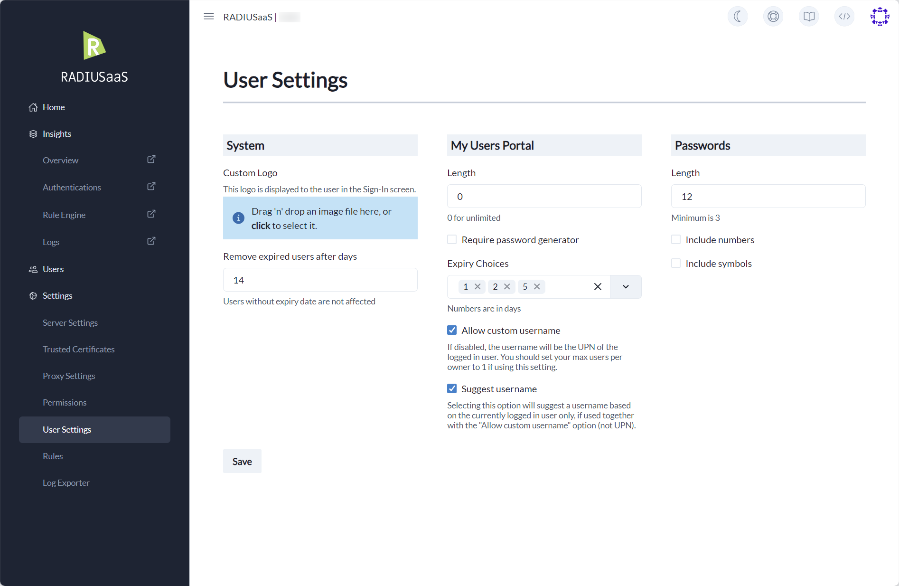

# User Settings

## Overview

With the User Settings page, you are able to configure how your website will handle User creation/deletions.&#x20;

Because there are two ways to create users, some settings only affect the **My Users** portal.

<figure><figcaption>
Showing user settings
</figcaption></figure>

### System

Upload your business' logo to show users upon sign in.&#x20;

These settings affect all users on the platform.

### My Users Portal

These settings only affect the **My Users** portal.

### Passwords

These settings are used to configure password complexity.
