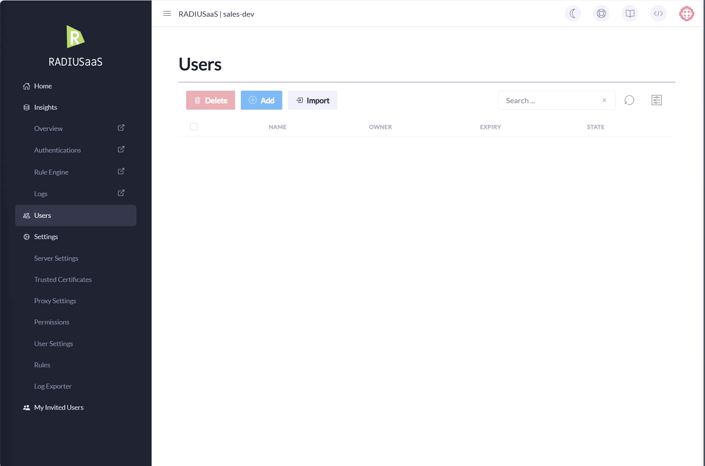

# Users

## General


RADIUSaaS **does not provide** any **integration** with Identity Providers (IDPs) for username/password-based network authentication. All username/password accounts used for network authentication with RADIUSaaS must be managed on the RADIUSaaS Admin Portal.


RADIUSaaS offers username/password-based authentication as an **alternative** to certificate-based authentication whenever the usage of certificates is technically hard to reach or not feasible. Such scenarios may include:

* Bring your own Device (BYOD)
* [Guest Access ](my-invited-users.md)
* Devices lacking EAP-TLS support for 802.1X (e.g. printers, TVs, ...)

## Protocols

Devices that use username and password for network authentication have to speak one of the following Protocols:&#x20;

* EAP-TTLS-PAP
* EAP-TTLS-MSCHAPv2
* PEAP-MSCHAPv2

## Add

To **Add** a new User, click **Add** and provide **Username** and **Password** and choose your **Validity**. After entering all details, click **Create**.


A username can be just a simple name such as "jack" or as complex as your UPN, however, be sure not to use your actual Entra ID UPN **and** the password associated with it for RADIUS authentication. While you may use the UPN or email address, please choose a different password.&#x20;


## Bulk User Import

To import your users from a supported file format (.xlsx, .xls or .csv file), click **Import** and follow the steps as shows below.


The required columns are **Username, Password** and **Owner**.


<figure><figcaption></figcaption></figure>

## Delete

To **Delete** users, select all users which should be deleted in the list, click **Delete and** confirm your choice.

## Update

To change a user's password, disable/re-enable a user or select a new validity period, simply click on the **eye** symbol next to the user entry, change all needed entries and save them.

<figure><figcaption>
Showing update of a user
</figcaption></figure>
