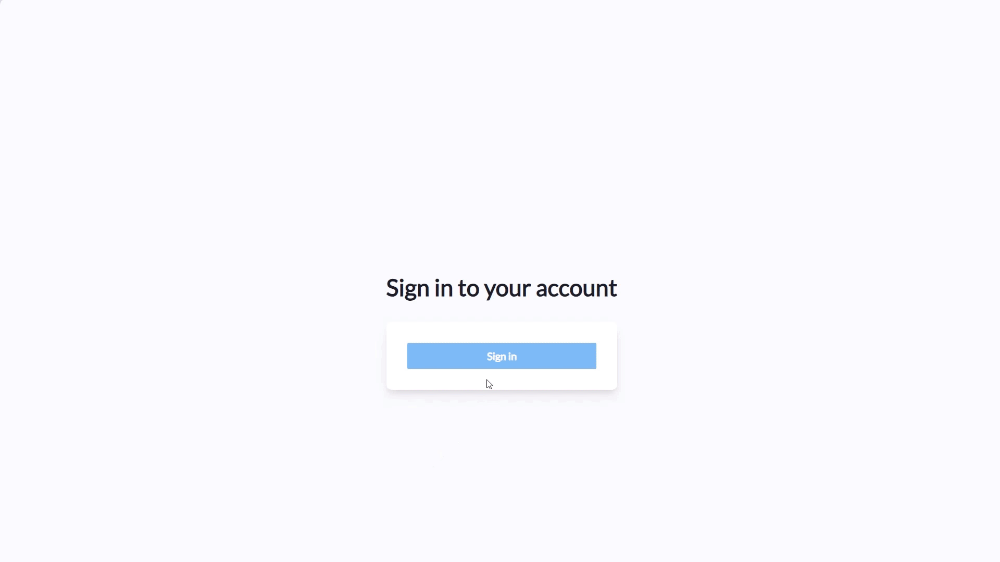

# My Invited Users

Any Entra ID identity/UPN that has been assigned the [**Users**](../admin-portal/settings/permissions.md#users) role, is able to create [username/password accounts](../admin-portal/users.md) with [certain constraints](../admin-portal/settings/user-settings.md).&#x20;

Those accounts are typically used for BYOD or guest access scenarios, enabling a self-sponsored access approach not requiring any administrator interaction. The [Rule Engine](../admin-portal/insights/rule-engine.md) can be leveraged to segregate such devices from more privileged network segments, e.g. using VLAN tagging.

UPNs that have only been assigned the Users role have access to the **My Invited Users** only and thus have below RADIUSaaS Admin Portal experience:&#x20;

<figure><figcaption>
Showing how to add new credentials
</figcaption></figure>

.
