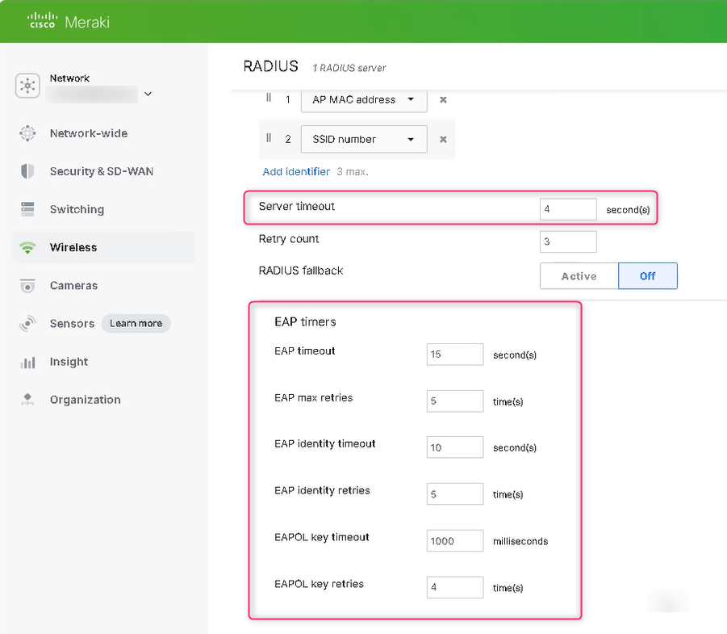

# Meraki


Starting with firmware version **MR 30.X**, Meraki APs support RadSec. Hence, we recommend to update your firmware version and follow the [RadSec guide for Meraki](../radsec-available/meraki.md) instead.


## Meraki configuration&#x20;

1. In your Meraki **Dashboard** go to **Wireless > SSIDs**
2. Enable a new SSID and give it the name you want
   1.  Save your changes

       .png>)
3. Edit the Settings of your SSID
   1. Under **Network access** select **Enterprise with my RADIUS server**.png>)
4. After that, go to **RADIUS servers** and add your RADIUS servers. Use the **IP Address** of your [**Proxy**](../../../admin-portal/settings/settings-server.md#properties-1), the **Port** 1812 and the **Shared Secret** from your [**Server Settings**](../../../admin-portal/settings/settings-server.md) page.png>)
5.  Configure **EAP parameters and timeouts** according to [this ](https://docs.radiusaas.com/other/faqs/general)reference guide by going to **Wireless** > **Radius** > **Advanced RADIUS settings.** Once configured, it should look similar to the screenshot below.&#x20;

    <figure><figcaption>
Showing <strong>EAP parameters and timeouts</strong>
</figcaption></figure>
6.  To **test** that the configuration works, you can add a user in your [Portal](../../../admin-portal/users.md#add-a-new-user) and use the Meraki test function

    .png>)
7. **Save** your changes.
