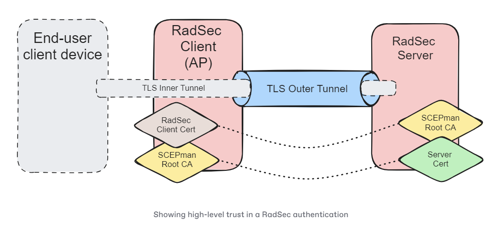

# RadSec

<figure><figcaption></figcaption></figure>

## Requirements

Before your access points are able to establish a valid **RadSec connection** (which can be considered an mTLS connection), there are requirements that must be met, regardless of the manufacturer of the access point.

* Access Points require a valid **client certificate** (typically referred to as "RadSec Client Certificate" or "RadSec Certificate"). This client certificate must have the **EKU Client Authentication** (1.3.6.1.5.5.7.3.2) and **not Server Authentication**.
* Access Points must **trust the CA** that has issued your **RADIUS Server Certificate**.
* RADIUSaaS must **trust the CA** that has issued the **RadSec client certificate** on your access points.


Some access points (counterintuitively) still require a shared secret when RadSec is configured. The [RadSec RFC](https://datatracker.ietf.org/doc/html/rfc6614) defines that a static and pre-define value must be used for this: "radsec".

