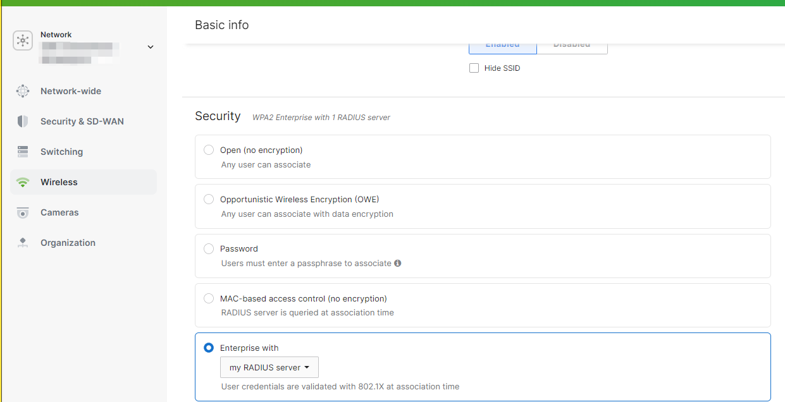
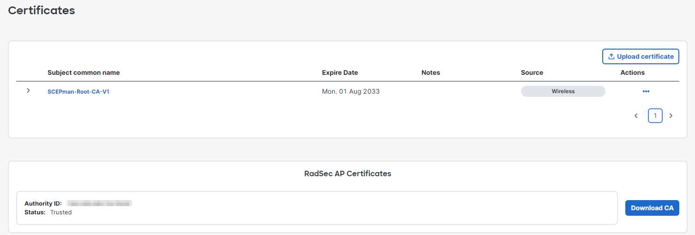

# Meraki


To use the RadSec feature on your Meraki APs, firmware version **MR 30.X** or later is required.



Customers have reported **delays** between activating the RadSec feature on the Meraki Dashboard and becoming functional.


## Prepare certificates


The Meraki platform does not allow you to generate RadSec client certificates from a CA of your choice. Instead, you must use Meraki's built-in **Organization CA** that is unique to your Meraki Organization.


Download the root certificate of the CA that has issued your active **RADIUS Server Certificate** as described [here](../../../admin-portal/settings/settings-server.md#download). You will need to upload it to your Meraki console later on.

## Meraki configuration


Below settings are the necessary settings to establish a functional RadSec connection with our service. Configure any other settings at your discretion.


1. Navigate to your **Meraki Dashboard**.
2. Select **Wireless > Access control**.
3.  Ensure you have switched to the **new UI version** of the Access control site.\

    <figure><figcaption></figcaption></figure>
4. Select the **SSID** you wish to configure RADIUS authentication for (or navigate to **Wireless > Configure > SSIDs** to create a new SSID first).
5.  In the **Security** section, select **Enterprise with** and in the dropdown **my RADIUS server**.\

    <figure><figcaption></figcaption></figure>
6.  Under **RADIUS**, click **Add server**. Configure the **Host IP or FQDN** to match the IP address or the DNS name of your [RadSec service endpoint](../../../admin-portal/settings/settings-server.md#properties), set the **Port** to 2083 and  set the **Secret** value to "radsec" and activate the **RadSec** checkbox.\

    <figure><figcaption></figcaption></figure>
7. Click **Save**.
8.  Configure **EAP parameters and timeouts** according to [this](../../../other/faqs/general.md#timers-and-timeouts) reference guide by going to **Wireless** > **Radius** > **Advanced RADIUS settings.** Once configured, it should look similar to the screenshot below.&#x20;

    <figure><figcaption>
Showing <strong>EAP parameters and timeouts</strong>
</figcaption></figure>
9.  To upload and generate the required certificates, navigate to **Organization > Certificates**. In the top table, click **Upload certificate** and provide the root certificate of the CA that has signed your [**RADIUS Server Certificate**](../../../admin-portal/settings/settings-server.md#server-certificates), which you should have already downloaded in this [step](meraki.md#prepare-certificates). Your Meraki APs now trust your RADIUS server.\

    <figure><figcaption></figcaption></figure>
10. Under **RadSec AP Certificates**, first create an **Organization CA** by clicking **Generate CA**. This CA is unique to your Meraki Organization.
11. Subsequently, trust that **Organization CA**. The Meraki platform will now automatically generate RadSec client certificates for all your APs signed by this CA. The lifetime of the certificate is very long (> 50 years), i.e. you do not have to worry about renewing them.\
    **Note:** you may need to convert the certificate as Meraki accepts PEM format. You can use [OpenSSL](https://docs.openssl.org/3.0/man1/openssl-x509/) to convert the format.\

    <figure><figcaption></figcaption></figure>
12. Eventually, establish trust between the APs and your RADIUSaaS platform. Therefore, download the root CA certificate of your **Organization CA** by clicking **Download CA**. Now, upload the downloaded CA certificate to your [Trusted Certificates](../../../admin-portal/settings/trusted-roots.md#add) and select **RadSec** under **Use for**.
13. Finally, disable the [revocation check for the RadSec client certificates](../../../admin-portal/settings/settings-server.md#verification-check-for-radsec-certificates) on your RADIUSaaS instance (this does not adversely affect security as the Meraki Organization CA does not allow to revoke RadSec client certificates). Therefore, navigating to your RADIUSaaS instance and then **Settings > Server Settings** and disable the checkbox **Verification check for RadSec certificates**.

### References

Link to Meraki's documentation for the RadSec configuration: [https://documentation.meraki.com/MR/Encryption\_and\_Authentication/MR\_RADSec](https://documentation.meraki.com/MR/Encryption_and_Authentication/MR_RADSec)
