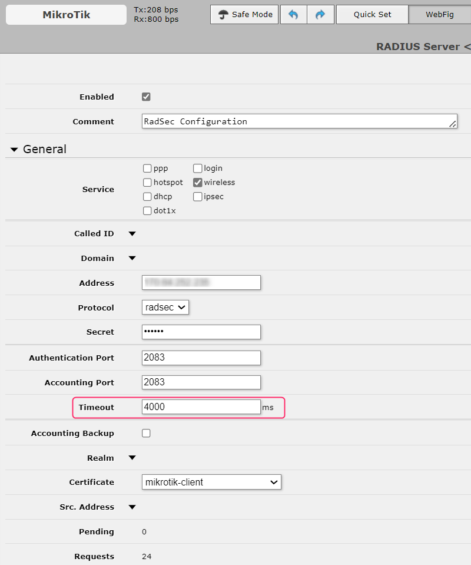

# MikroTik

## Prepare certificates

To establish a valid RadSec connection, the MikroTik Access Points must trust the **RADIUS Server Certificate** and your RADIUS server must trust the **RadSec Client Certificate**.  To achieve this, follow below steps:

### Option 1: Using the SCEPman PKI

1. Download the root certificate of the CA that has issued your active **RADIUS Server Certificate** as described [here](../../../admin-portal/settings/settings-server.md#download). Since you are using SCEPman, that might be your SCEPman Root CA certfiicate.
2. Log on to your MikroTik device, then upload the certificate from step 1 above to the MikroTik device using the **Files** menu on the left.
3. Once uploaded, switch to your **Terminal** tab on the top right and execute the following command to import this certificate to MikroTik's certificate store:

```
/certificate import file-name="scepman-root.cer"
```

4.  Generate a **RadSec Client Certificate** using **SCEPman Certificate Master** by navigating to the [**Client Certificate**](https://docs.scepman.com/certificate-deployment/certificate-master/client-certificate-pkcs-12) menu:\


    <figure><figcaption></figcaption></figure>


Ensure to monitor the expiry of your **RadSec Client Certificate** and renew it in due time to prevent service interruptions.


5. Once the **RadSec Client Certificate** is downloaded, extract the private key, e.g. using OpenSSL, as this will have to be imported to the access point separately:&#x20;

```
openssl pkey -in yourfile.pem -out private.key
```

6. Upload both files, the certificate and the private key via the **Files** menu. Then import the certificate first and then the private key. During the import process the **private key** will merge with the certificate indicated by a letter '**K**' as shown below.&#x20;

<figure><figcaption></figcaption></figure>

### Option 2: Using other PKIs


Use this section if you want to create a root CA on your Mikrotik AP and generate a **RadSec Client Certificate** from this root. Please note that all of these steps can be completed either in GUI or terminal.


1. Download the root certificate of the CA that has issued your active **RADIUS Server Certificate** as described [here](../../../admin-portal/settings/settings-server.md#download).
2. Log on to your MikroTik device, then upload the certificate from step 1 above to the MikroTik device using the **Files** menu on the left.
3. Once uploaded, switch to your **Terminal** tab on the top right and execute the following command to import this certificate to MikroTik's certificate store:

```
/certificate import file-name="RADIUS Customer CA - Contoso.cer"
```

4. If you have not already generated **RadSec Client Certificate** for MikroTik AP, generate one as per the below example. For more information about creating certificates, click [here](https://wiki.mikrotik.com/wiki/Manual:Create_Certificates).&#x20;


Ensure to monitor the expiry of your **RadSec Client Certificate** and renew it in due time to prevent service interruptions.


Example:&#x20;

```
/certificate add name=myCa common-name=myCa key-usage=key-cert-sign,crl-sign
/certificate add name=mikrotik-client common-name=mikrotik-client
/certificate sign mikrotik-client ca=myCa name=mikrotik-client
```

In the above example, the first line creates a root CA called **myCa**. The second line generates a client certificate for the MikroTik device, and the third line uses **myCa** (CA) to sign the **mikrotik-client** certificate generated in step 2. If all went well, you would end up with three certificates as shown below. Please ensure your MikroTik device trusts the relevant certificates (**T** flag in the green section). If that is not the case yet, set the flag using below command:

```
/certificate
set myCa trusted=yes
set "RADIUS Customer CA - Contoso.cer" trusted=yes
```

<figure><figcaption></figcaption></figure>

5. Export the root CA certificate (`myCa`) that has issued your **RadSec Client Certificate** above:

```
/certificate export-certificate myCa
```

6. Download it from the **Files** menu and then upload the file to your RADIUSaaS instance as described [here](../../../admin-portal/settings/trusted-roots.md#add) and select **RadSec** under **Use for.** Once completed, continue configuring your MikroTik AP as per [below ](mikrotik.md#mikrotik-configuration)and use **Option 1** for certificates.

## MikroTik Configuration


Please note that the below configuration was tested with RouterOS 6.47.4 and 6.49.11


1. Switch back to your WebFig, add a new RADIUS profile and enter the following information:

<table><thead><tr><th width="198">Parameter</th><th>Value</th></tr></thead><tbody><tr><td>Address</td><td>Use the IP address from your <a href="../../../admin-portal/settings/settings-server.md">Server Settings </a>page.</td></tr><tr><td>Protocol</td><td>radsec</td></tr><tr><td>Secret</td><td>"radsec"</td></tr><tr><td>Authentication Port</td><td>2083</td></tr><tr><td>Accounting Port</td><td>2083</td></tr><tr><td>Timeout</td><td>4000 ms</td></tr><tr><td>Certificate</td><td><a href="mikrotik.md#option-1-using-the-scepman-pki"><strong>Option 1</strong></a>: SCEPman Issued (RadSec) Client Certificate (generated in step 4).<br><a href="mikrotik.md#option-2-using-other-cas"><strong>Option 2</strong></a>: <strong>RadSec Client Certificate</strong> issued by MikroTik's built-in CA (generated in step 4).</td></tr></tbody></table>




2. Go to **Wireless,** add a new **Security Profile** and enter the following information:&#x20;

<table><thead><tr><th width="227">Parameter</th><th>Value</th></tr></thead><tbody><tr><td>Name</td><td>Name of the RADIUS security profile</td></tr><tr><td>Mode</td><td>dynamic keys</td></tr><tr><td>EAP Methods</td><td>passthrough</td></tr><tr><td>TLS Mode</td><td>verify certificate</td></tr><tr><td>TLS Certificate</td><td><a href="mikrotik.md#option-1-using-the-scepman-pki"><strong>Option 1</strong></a>: SCEPman Root CA certificate.<br><a href="mikrotik.md#option-2-using-other-cas"><strong>Option 2</strong></a>: RADIUSaaS Customer-CA certificate.</td></tr></tbody></table>

.png>)

3. Switch to your **Wi-Fi Interfaces** and assign your **Security Profile** to the interface.

.png>)
