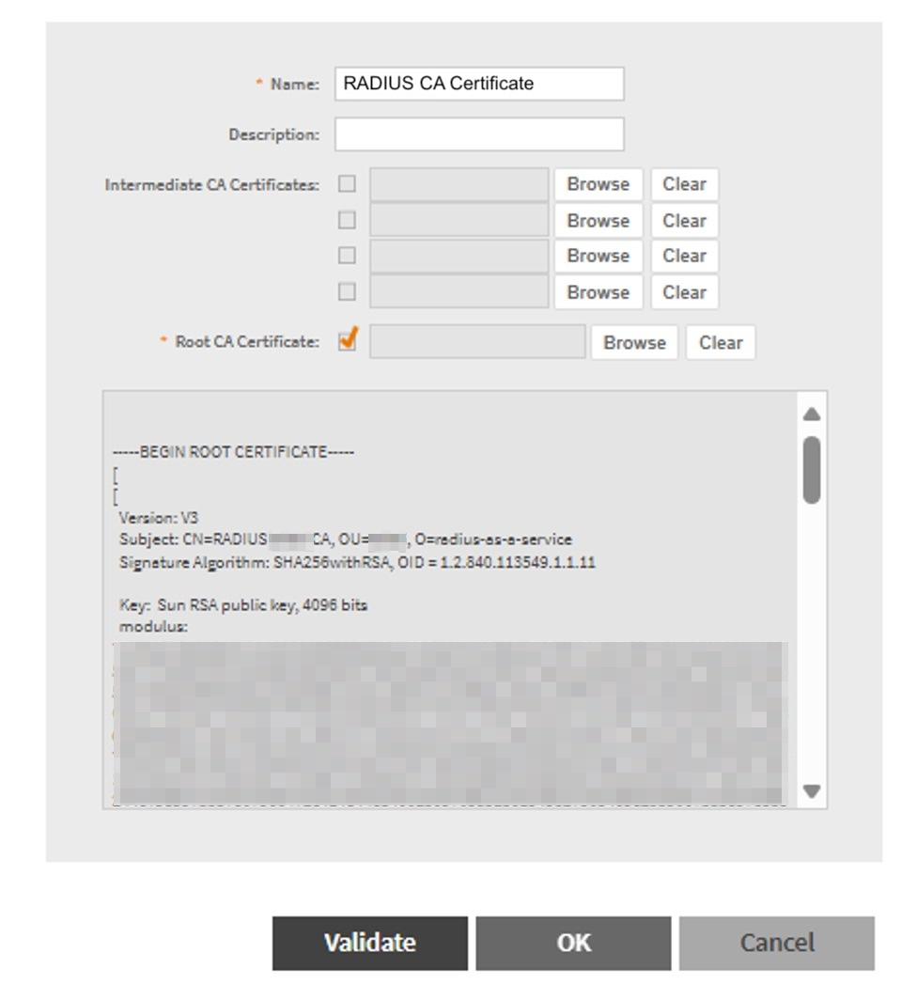
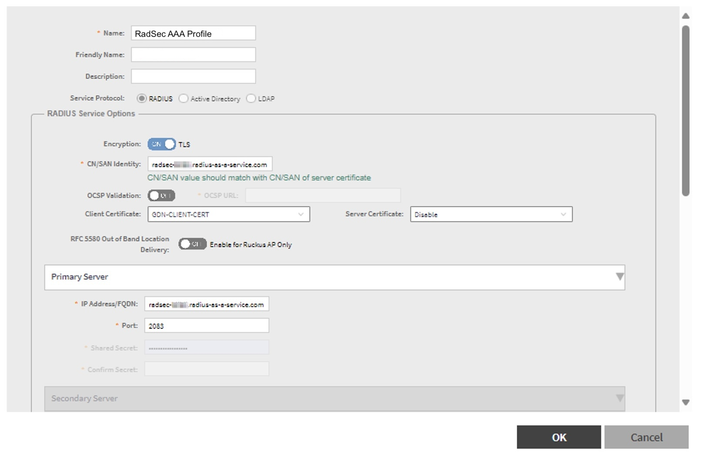

# Ruckus


The following guide was created using Ruckus **Virtual SmartZone Essentials** version **6.1.2.0.441**.


## Prepare Certificates

1. Download the root certificate of the CA that has issued your RADIUS server certificate as described [here](../../../admin-portal/settings/settings-server.md#download).
2. Create a RadSec client certificate for your Ruckus SmartZone. If you are using **SCEPman Certificate Master**, the process is described [here](https://docs.scepman.com/certificate-deployment/certificate-master/client-certificate-pkcs-12).&#x20;


Ensure to monitor the expiry of your RadSec client certificate and renew it in due time to prevent service interruptions.


3. Add the root certificate of the CA that has issued the RadSec client certificate to your RADIUS instance as described [here](../../../admin-portal/settings/trusted-roots.md#add) and select **RadSec** for the trusted certificate type.

## Ruckus SmartZone (SZ) Configuration


In the following, Ruckus SZ is configured as an **authentication proxy**, i.e. RADIUS authentication requests are routed from the WAPs to the Ruckus SZ and centrally forwarded to RADIUSaaS.


For general information on how to import certificates to the Ruckus SmartZone, please refer to their documentation:



1. Import the root certificate of the CA that has issued your RADIUS server certificate (downloaded during step 1 [here](ruckus.md#prepare-certificates)) by navigating to **Administration >** **System > Certificates > SZ Trusted CA Certificates/Chain (external)**.
2.  Click **Import**, provide a **Name** and optional **Description** for your RADIUS CA certificate and upload the certificate file by clicking **Browse** next to **Root CA Certificate**. In case you are bringing your own RADIUS server certificate and in case it has been issued by an intermediate CA, please also upload all intermediate certificates under **Intermediate CA Certificates**.\

    <figure><figcaption></figcaption></figure>
3. Next, click **Validate** and **OK**.
4. Prepare your RadSec client certificate for import to the Ruckus SZ by decomposing the certificate obtained from step 2 [here](ruckus.md#prepare-certificates) into its private key and public portion. In case the RadSec client certificate was downloaded in the **PKCS#12/.pfx** format, this can be achieved using the following OpenSSL commands:\
   \
   Private Key:\
   `openssl pkcs12 -in <your-radsec-client-cert>.pfx -nocerts -nodes -out private.key`\
   \
   Certificate without Private Key:\
   `openssl pkcs12 -in <your-radsec-client-cert>.pfx -clcerts -nokeys -out certificate.cer`&#x20;
5. Import your RadSec client certificate (obtained from step 2 [here](ruckus.md#prepare-certificates)) by navigating to **Administration >** **System > Certificates > SZ as Client Certificate**.
6.  Click **Import** and provide a **Name** and optional **Description** for your RadSec client certificate. Then upload the public portion of your RadSec client certificate by clicking **Browse** next to **Client Certificate**. Finally, upload the private key by clicking **Browse** next to **Private Key**.\

    <figure><figcaption></figcaption></figure>
7. For the RADIUS server configuration, navigate to **Security > Authentication > Proxy (SZ Authenticator)**.
8. Click **Create** and provide a **Name**, optional **Friendly Name** and **Description** for the RADIUS profile.
9. Select **RADIUS** as **Service Protocol**.
10. Under **RADIUS Service Options**, configure the following settings:

| **Encryption**                            | Enable                                                                                                                                                                                                             |
| ----------------------------------------- | ------------------------------------------------------------------------------------------------------------------------------------------------------------------------------------------------------------------ |
| **CN/SAN Idenity**                        | 
Provide the CN/SAN attribute of your RADIUS server certificate. 

 |
| **OCSP Validation**                       | 
Default: Disabled In case you are bringing your own RADIUS server certificate and the CA that has issued it allows for its revocation, provide the OCSP Responder URL of your CA here.
                   |
| **Client Certificate**                    | Select the RadSec client certificate uploaded to Ruckus SZ previously.                                                                                                                                             |
| **Server Certificate**                    | Disable                                                                                                                                                                                                            |
| **RFC5580 Out of Band Location Delivery** | Disable                                                                                                                                                                                                            |

10. Next, under **Primary Server**, for the **IP Address/FQDN** choose either the IP address or the DNS name of your [RadSec service endpoint](../../../admin-portal/settings/settings-server.md#properties). For the **Port** select **2083**. \

    <figure><figcaption></figcaption></figure>
11. Click **OK**.
