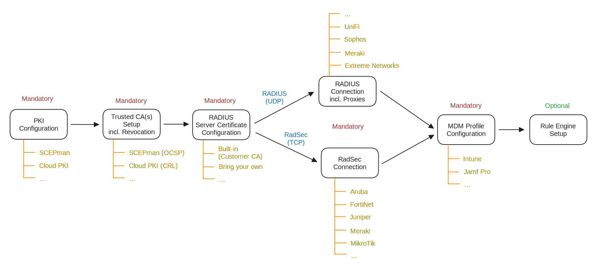

# Getting Started

## Checklist

Let's start with some essential questions:

* [ ] What PKI(s) are you using to issue the client authentication certificates?
* [ ] Shall device- or user-type client authentication certificates be used for authentication?
* [ ] Which MDM system are you using (e.g. Intune and/or Jamf Pro) and do you have access and rights to create device configuration profiles?
* [ ] Does your networking equipment support RadSec (RADIUS via TCP/TLS) and/or RADIUS (UDP)?&#x20;
* [ ] Do you have access to the management portal of your networking gear?
* [ ] Do you have permissions in your Azure tenant to consent the Basic User Profile Read Access? This is needed to access your RADIUSaaS Portal.

## General Structure

Below diagram details the generic setup procedure as explained in our guides below. The linear procedure forks depending on whether your network equipment supports **RadSec** natively **or** **RADIUS** only. Thus, in case you have requirements for both (e.g. due to a heterogeneous AP and/or switch fleet), both configurations must be completed.

Besides our [Generic Guide](generic-guide.md), we have prepared [Scenario-based Guides](scenario-based-guides/) describing how RADIUSaaS can be configured for certificate-based WiFi authentication together with popular Cloud PKI solutions:

* RADIUSaaS with SCEPman
* RADIUSaaS with Microsoft Cloud PKI

## Generic Guide


[generic-guide.md](generic-guide.md)


## Scenario-based Guides


[microsoft-cloud-pki.md](scenario-based-guides/microsoft-cloud-pki.md)

