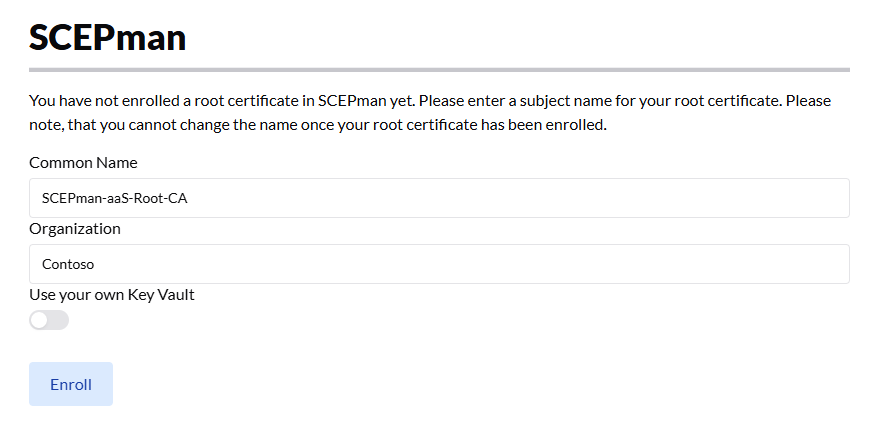

# 🆕 SCEPman SaaS

<code class="expression">space.vars.SCEPmanSAAS_ProductName</code> is a fully managed SCEPman deployment, hosted and maintained entirely by us. It is available as part of the RADIUSaaS & <code class="expression">space.vars.SCEPmanSAAS_ProductName</code> Bundle, which combines both services into a single subscription. This eliminates the need to set up and manage your own SCEPman instance while still providing seamless certificate-based authentication for your RADIUS environment. The following guide walks you through the initial configuration steps to get your <code class="expression">space.vars.SCEPmanSAAS_ProductName</code> instance up and running with RADIUSaaS

## Setup <code class="expression">space.vars.SCEPmanSAAS_ProductName</code>


If you are already using an existing SCEPman Enterprise deployment in your tenant with RADIUSaaS, make sure to have a look at our migration guide: [migrate-from-scepman-enterprise.md](migrate-from-scepman-enterprise.md "mention")




### Enroll <code class="expression">space.vars.SCEPmanSAAS_ProductName</code>

With an enabled <code class="expression">space.vars.SCEPmanSAAS_ProductName</code> license, you will see that the menu section in **Settings** > **SCEPman** contains options to enroll and configure your SCEPman CA.

At the top you have the ability to choose the **Common Name** as well as the **Organization** name for your CA.

<figure><figcaption></figcaption></figure>


The Common Name and Organization will form the subject of the CA certificate during the enrollment.


By clicking **Enroll**, the setup will start and the status is shown above. After a few minutes the deployment should have been finished and you will see that the RADIUSaaS main menu now contains a section for [**SCEPman**](../../admin-portal/scepman.md).



The **Status** page shows the current state of the CA and its integrations as well as the endpoint URLs you need to request certificates.

<figure><figcaption></figcaption></figure>



Under **Manage Certificates** you can browse through issued certificates, check their validity, and also have the option to revoke them.

<figure><figcaption></figcaption></figure>



Under **Request Certificates**, you can request different types of certificates for manual enrollment and installation or sign CSRs.


Have a look at the dedicated [Certificate Master](https://docs.scepman.com/certificate-management/certificate-master) documentation for more information on the different types of certificates you can request here.


<figure><figcaption></figcaption></figure>



The **Tasks** section shows the current status of the Certificate Master and links to sections permitted by your role.

<figure><figcaption></figcaption></figure>




SCEPman is now deployed and ready to issue certificates!




### Connect SCEPman to your Azure Tenant


You will only need to connect SCEPman to your Azure tenant if you plan to deploy certificate through Intune or the StaticAAD endpoint.


In most scenarios you will want SCEPman to be able to issue certificates by using Intune SCEP profiles and also revoke certificates automatically if a device has been wiped for example.

For this to work as intended, SCEPman requires specific roles in your tenant. This can either happen by consenting to our multi-tenant enterprise application or by providing an app registration holding the required permissions yourself.

#### Confirm Tenant


We recommend the Admin Consent / multi-tenant enterprise application approach to connect to your Azure tenant, since it does not require a client secret that must be monitored for expiration.


The first step of the **Admin Consent** flow is to enter your tenant ID and confirming it.

<figure><figcaption></figcaption></figure>

Upon clicking **Confirm Tenant** you will be redirected to Microsofts consent page for authentication and to approve this application initially:

<figure><figcaption></figcaption></figure>

Accepting this consent will add the <code class="expression">space.vars.SCEPmanSAAS_ProductName</code> enterprise application to your tenant but does not yet add the required permissions.

#### Consent Admin

<figure><figcaption></figcaption></figure>

After confirming the tenant, clicking **Consent Admin** will again redirect you to Microsoft's consent page and asks for your confirmation if the application should be granted the listed permissions. For more information on the required permissions, please refer to our [Security & Privacy Q\&As](../../other/faqs/security-and-privacy/#id-5.-which-tenant-permissions-do-users-accessing-the-radiusaas-web-portal-have-to-consent-to).

<figure><figcaption></figcaption></figure>


SCEPman is now able to connect to your Azure tenant and retrieve information for certificate binding!




### Enable Certificate Endpoints

In most scenarios, certificates will be deployed by leveraging Intune SCEP certificate profiles to trigger devices to request certificates from SCEPman. To enable this endpoint, navigate to **Settings** > **SCEPman** again and enable the **Intune Validation** setting and save the configuration:

<figure><figcaption></figcaption></figure>

#### Compliance Check

As with SCEPman Enterprise, SCEPman can evaluate the validity of a certificate by checking the compliance state of a bound device. Please refer to the  [SCEPman documentation on this setting](https://docs.scepman.com/scepman-configuration/application-settings/scep-endpoints/intune-validation#appconfig-intunevalidation-compliancecheck) for more information.

#### Device Directory

Selecting the device directory depends on the specific binding you choose in the SCEP profile:

* `{{DeviceId}}` will be looked up in **Intune**
* `{{AAD_DeviceID}}` will be looked up in **AAD** (Entra ID)
* `{{UserPrincipalName}}` (UPN) will be looked up in **AAD** (Entra ID)

Please refer to the [SCEPman documentation](https://docs.scepman.com/scepman-configuration/application-settings/scep-endpoints/intune-validation#appconfig-intunevalidation-devicedirectory) for more details on the device directories.


The Intune validation is now enabled and its certificate endpoint is available!




### Deploy Certificates

With the Intune validation enabled, you will find that the SCEPman status page now shows an endpoint URL for the Intune MDM:

<figure><figcaption></figcaption></figure>

This URL will be used in the Intune SCEP certificate profile for the **SCEP Server URL**.

#### Root Certificate

Make sure to create a **Trusted Certificate** profile in Intune before continuing to the **SCEP certificate** profile and deploy the CA certificate of <code class="expression">space.vars.SCEPmanSAAS_ProductName</code> to your clients.

[SCEPman documentation: Root Certificate](https://docs.scepman.com/certificate-management/microsoft-intune/windows-10#root-certificate)

<figure><figcaption></figcaption></figure>

#### SCEP Certificate

The process of creating the SCEP certificate profile is identical to SCEPman Enterprise.

[SCEPman documentation: SCEP - Intune - Windows](https://docs.scepman.com/certificate-management/microsoft-intune/windows-10)

<figure><figcaption></figcaption></figure>


Your clients should now receive certificates issued by SCEPman!




## Establish Trust

To allow devices to authenticate using certificates from your <code class="expression">space.vars.SCEPmanSAAS_ProductName</code> CA and enabling your access points to establish RadSec connections to your RADIUSaaS instance, you will need to trust its CA certificate. To do this, first download your CA certificate from the **SCEPman** > **Status** page.

<figure><figcaption></figcaption></figure>

Having the CA certificate in place, navigate to **Settings** > **Trusted Certificates** and add a new certificate.

<figure><figcaption></figcaption></figure>

Upload your downloaded certificate file and save:

<figure><figcaption></figcaption></figure>


RADIUSaaS will now accept accept incoming connections that use certificates issued by SCEPman!


## Enable Management of the RADIUSaaS Server Certificate

After you have enrolled <code class="expression">space.vars.SCEPmanSAAS_ProductName</code>, you will notice that the SCEPman Connection section under **Settings** > **Server Settings** allows you to pregenerate a certificate and setup a connection.

<figure><figcaption></figcaption></figure>

A connection to your SCEPman instance has already been established at this point and RADIUSaaS can request server certificates. The correct way of going further now depends on if you already use RADIUSaaS to authenticate clients at this point or if this is a fresh setup.

#### Pregenerate Certificate

RADIUSaaS will request a server certificate and add it to the list of certificates but **will not activate it or enable the automatic management.**

In case you currently have clients authenticating to RADIUSaaS, this allows you to verify that your Wifi profile has the correct names for server validation as well as the correct root certificate for server validation.

<figure><figcaption></figcaption></figure>

#### Setup Connection

If this is a fresh setup or after you have verified that your clients use the correct information for validating the server certificate, you can enable the automatic management of the server certificate by clicking **Setup Connection**.

<figure><figcaption></figcaption></figure>


RADIUSaaS will now request a server certificate from SCEPman, activate it, and renew it in time before it expires!


## Other Certificate Endpoints

Setting up other certificate endpoints is similar to the way they are set up with SCEPman Enterprise. Make sure to take a look at the relevant documentation:

#### General


[scepman.md](../../admin-portal/settings/scepman.md)


#### Jamf



#### Static Validation



#### Static-AAD Validation



#### DC



## Logs

You can find all application logs that you would expect in SCEPman Enterprise in the **Logs** section. These include:

* Service Health Messages
* Issued Certificates
* OCSP Responses
* Warnings and Errors during Validation and Issuance

<figure><figcaption></figcaption></figure>

