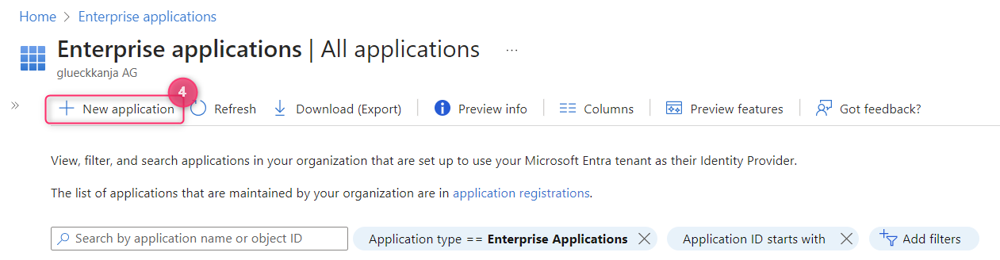

# General

## Authentication

#### How often is a device typically authenticating against RADIUSaaS?

This is difficult to answer as it depends on the behavior of your users, clients and networking gear (APs, NACs, switches). Additionally, it is **important** to note that RADIUSaaS will neither

* trigger an authentication, nor
* send a termination request via its accounting port to the client, potentially triggering a re-authentication.

If you feel your devices are authenticating very frequently (multiple times an hour) without the user constantly restarting the client, then this could be for the following reasons:

* The network controller doesn't authenticate the client fast enough for the client to join the network, so the client attempts to authenticate again. Check the network controller to see if/when it is receiving an answer from RaaS.&#x20;
* The network controller is re-initiating authentication. Check the network controller for what might be causing this.&#x20;

## RADIUSaaS Admin Portal

#### How can I add the RADIUSaaS Admin Portal to My Apps?

**Create the App**

First you have to create an Enterprise app. To do this via the Azure portal, follow these steps:

1. Login to your [Azure](https://portal.azure.com/) account
2. Go to **Microsoft Entra ID**
3. Select **Enterprise applications**
4. Click **+ New Application**

<figure><figcaption>
Showing creation of a new application
</figcaption></figure>

5. Click **+ Create your own application**
6. Give a name for the app (e.g. RADIUSaaS Portal)
7. Choose **Integrate any other application you don’t find in the gallery** and&#x20;
8. Click **Create**

<figure><figcaption></figcaption></figure>

After that the app is set up, we now need to add users to it and configure the logo and link

**Add Users and a Logo**

1.  Under **Manage** go to **User and groups** - Add all users/groups who should be able to view/use your new URL tile and save

    <figure><figcaption>
Click "User and groups"
</figcaption></figure>
2.  Click **Properties** - Upload an image logo of your choice and save

    <figure><figcaption>
Click "Properties"
</figcaption></figure>
3.  Click **Single Sign-on** - Select **Linked** mode - Then enter the URL you want and save.

    <figure><figcaption>
Click Single Sign-on - Select "Linked" mode
</figcaption></figure>

    <figure><figcaption>
enter the URL you want
</figcaption></figure>

**Access My Apps**

Your users should now be able to access the newly created link tile via [My Apps](https://myapps.microsoft.com/).

## RADIUS Return Attributes

#### Which VLAN-related attributes does RADIUSaaS return by default?


In case you require other VLAN attributes than returned by default, please [contact our support](https://www.radius-as-a-service.com/help/).


`"WiMAX-VLAN-ID"`

`"Nexans-Port-Default-VLAN-ID"`

`"Dlink-VLAN-ID"`

`"UTStarcom-VLAN-ID"`

`"DHCP-IEEE-802.1Q-VLAN-ID"`

`"Motorola-WiMAX-VLAN-ID"`

`"Telrad-C-VLAN-ID"`

`"Telrad-S-VLAN-ID"`

`"SN-Assigned-VLAN-ID"`

`"Extreme-VM-VLAN-ID"`

`"Ruckus-VLAN-ID"`

`"Mikrotik-Wireless-VLANID"`

`"Egress-VLANID"`

`"HP-Egress-VLANID"`

`"Tunnel-Private-Group-Id"`

## Secondary Instance and Failover

#### How does a secondary instance behave in terms of failover?

A secondary instance means that you have at least a secondary RadSec server that works independently of your main instance but has the same configuration. If you have one, you can see multiple IP Addresses under [RadSec IP Addresses](../../admin-portal/settings/settings-server.md#properties).

**RadSec Connection**

Since the RadSec servers are independent from each other, they will not handle any kind of failover. You should add both IP addresses/DNS entries to your Network controller which decides to which server the authentication requests are forwarded.&#x20;

**RADIUS Connection**

With your RADIUS proxies, it's a little different: Your proxies are aware of each of your RadSec instances and their health states and thus will handle failover if the primary server fails.

## Timers & Timeouts

#### What EAP parameters and timeouts should be configured?

Not every access point or switch (authenticator) provides you with the same amount of configuration options for EAP and general (RADIUS server) timeout parameters. Below overview presents the maximum set of parameters known to us and how they should be configured to allow for maximum reliability of the connection between the authenticator and RADIUSaaS.

**RADIUS Server Timeout**

5 seconds

**EAP Parameters**

<table data-header-hidden><thead><tr><th width="261"></th><th></th></tr></thead><tbody><tr><td>EAP timeout</td><td>15 s</td></tr><tr><td>EAP max retries</td><td>5</td></tr><tr><td>EAP identity timeout</td><td>10 s</td></tr><tr><td>EAP identity retries</td><td>5</td></tr><tr><td>EAPOL key timeout</td><td>1000 ms</td></tr><tr><td>EAPOL key retries</td><td>4</td></tr></tbody></table>

## Logs

#### How can I identify the public IP address (PIP) of the site from which an authentication originates?

To identify the PIP of the authenticating site for a particular authentication, the approach depends on whether you are using a RADIUS connection (via the RADIUS proxies) or a direct RadSec connection:

**RadSec Connection**

* Navigate to **Insights > Logs**
* Configure the relvant timerange / search window
* Set the **Logtype** filter  to **details**
* Identify the relevant authentication (by correlating the timestamp and username)
* Identify an ACCESS\_REQUEST message (**message > Packet-Type** = **Acess-Request**) that belongs to the authentication under investigation
* Expand the respective log entry
*   The PIP can be extracted from the **message > Packet-Src-IP-Address** property of the log entry.\

    <figure><figcaption></figcaption></figure>

**RADIUS Connection**

* Navigate to **Insights > Logs**
* Configure the relvant timerange / search window
* Set the **Logtype** filter  to **proxy**
* Identify the relevant authentication (by correlating the timestamp and username)
*   The PIP can be extracted from the **message** property of the log entry:\

    <figure><figcaption></figcaption></figure>
