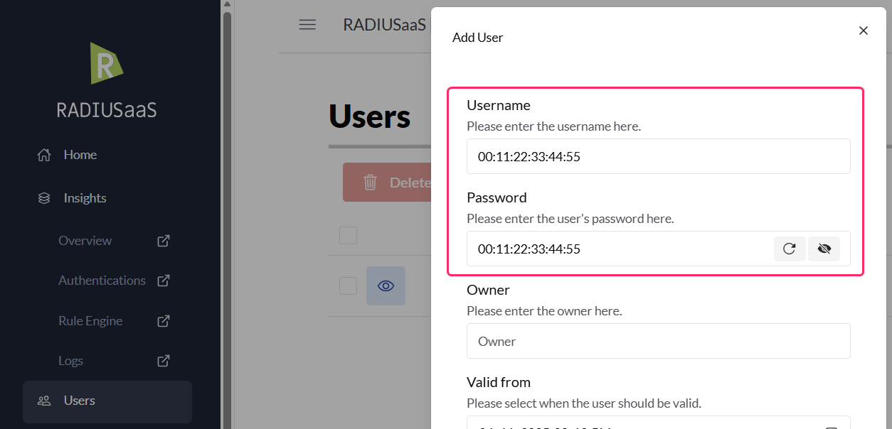

# MAC Authentication Bypass


Since **MAC addresses can be easily spoofed**, implementing a MAC authentication bypass is **strongly discouraged** unless absolutely necessary and the administrator has weighed the risk associated with implementing such a bypass against the convenience and budgetary constraints of upgrading outdated hardware.


## Overview

**MAC Authentication Bypass (MAB)** is a feature that enables devices unable to perform standard 802.1X enterprise authentication (such as legacy printers, simple sensors, or embedded systems) to connect to an otherwise secure network. MAB grants access by using a device's unique MAC address as its sole identifier against an authorised list maintained by a RADIUS server.&#x20;

The legacy implementation of MAB is **vulnerable to MAC address spoofing both on** the connection between the authenticating and the network device and on the connection between the network device and the RADIUS server. To eliminate the second attack vector, a stronger implementation of MAB, called **MAB-to-EAP**, can be used, which effectively ensures the integrity of the MAC address transmitted to the RADIUS server (the MAC address can still be spoofed on the link between the authenticating and network device).

This guide details the differences between the insecure legacy method **Pure MAB** and the modern, transport-secured workaround.

## MAB Terminology and Implementations&#x20;

**MAB:** MAC Authentication Bypass

**EAP:** Extensible Authentication Protocol

**Supplicant:** The entity (such as a laptop, phone, or network interface) that initiates the authentication process with an Authenticator to gain access to a network.

**Authenticator:** A network entity (such as a switch, wireless access point, or VPN gateway) that enforces authentication before granting a Supplicant access to the network.

**Authentication Server:** A trusted network entity (such as RADIUS server) responsible for verifying the identity of Supplicants by checking their credentials (such as usernames, passwords, or digital certificates) and determining whether they are authorised to access the network.

**Pure MAB** (Legacy Implementation): This method involves the Authenticator sending the client's MAC address to a RADIUS server, usually in the `Calling-Station-Id`  RADIUS attribute. The RADIUS server performs a simple lookup and returns an `Access-Accept` or `Access-Reject`. The MAC address acts as the identifier, not a true credential.

**MAB-to-EAP** (Secured Implementation): Because Pure MAB lacks cryptographically secure transport, many modern services (like RADIUSaaS) require a stronger approach. In this method, the Authenticator uses the client's MAC address as both the username and password and then attempts to authenticate to the RADIUS server using a secure EAP protocol (e.g., EAP-TTLS-PAP, PEAP-MSCHAPv2). The client device remains oblivious that any authentication has occurred.

## How Pure MAB Works (External RADIUS Database)

When the MAC address database is maintained by an external RADIUS server (the common enterprise setup), the following sequence applies for Pure MAB:

1. A non-802.1X client connects and requests network access.
2. The Authenticator detects the connection and, seeing no 802.1X negotiation, initiates an MAB attempt.
3. The Authenticator takes the client's MAC address (e.g., `00:11:22:33:44:55`) and forwards it to the RADIUS server in an `Access-Request` message. The MAC address is typically parsed into the `Calling-Station-Id` RADIUS attribute.
4. The RADIUS server checks its configured database for the presence of the MAC address.
5. It returns an `Access-Accept` message if the MAC is found (Match) or an `Access-Reject` if it is not found (No Match).
6. If `Access-Accept` is received, the Authenticator authorises the port and allows the client to join the network.

### Security Considerations

In general, **MAB provides little to no security** and should be used with extreme caution.&#x20;

* **MAC Spoofing:** MAC addresses are easily changed (spoofed) on most modern computers and network cards. A malicious actor can observe the MAC address of an authorised device and configure their own device to use it, thereby gaining unauthorised access.
* **Identification, Not Authentication:** MAB is merely a form of device identification. It only confirms which device is connecting, not who owns it or if it is cryptographically secure.

Because of these weaknesses, most modern cloud-based authentication services (like RADIUSaaS) do not support Pure MAB or legacy protocols like PAP or CHAP. Instead, they require the MAB-to-EAP method where the MAC address is used as credentials within a cryptographically strong EAP tunnel.&#x20;

## MAB Implementation with EAP (a RADIUSaaS Approach to MAB)

When MAB is configured on an Authenticator and a legacy device that does not support 802.1X tries to request network access, the switch or AP will pretend to be that device and takes over the authentication on behalf of the client by authenticating to RADIUSaaS using one of the supported EAP [protocols](https://docs.radiusaas.com/admin-portal/users#protocols): EAP-TTLS-PAP or PEAP-MSCHAPv2. As part of this process, RADIUSaaS will check if the MAC address is listed in the RADIUSaaS database in the form of a manually added [User](../../admin-portal/users.md). (username = password = MAC address), If so, then an `Access-Accept` message is returned, and the EAP-based authentication completes giving the legacy device network access. Since the Authenticator is establishing a TLS connection to RADIUSaaS, it must trust the [Server Certificate](../../admin-portal/settings/settings-server.md#server-certificates) RADIUSaaS uses.

The use of the MAC address as username/password to trigger EAP is a specific workaround implemented by the Authenticator to simulate MAB while utilising stronger EAP protocols.

### Does MAB work with RADIUSaaS?

MAB in its original implementation using PAP or CHAP does not work with RADIUSaaS. With the above definitions in mind, the current implementation of RADIUSaaS can support MAB as long as your Authenticator can authenticate via one of the aforementioned protocols. Keep in mind that as soon as these supported protocols are used in the authentication, we no longer bypass authentication, and this is when the more specific term of MAB-to-EAP is used.&#x20;

### Configuration

**MAB** requires configuration on both the Authenticator and the Authentication Server.&#x20;

**Authenticator:**

* Enable 802.1X and MAC Authentication Bypass (MAB) on the specific access ports/SSIDs meant for non-802.1X devices.
* Trust the [RADIUS server certificate](../../admin-portal/settings/settings-server.md#download).
* _Note: Configuration steps are vendor-specific; refer to your device documentation._

**Authentication Server:**

* When implementing MAB-to-EAP, you must create an explicit authorisation rule on RADIUSaaS to assign all devices authenticating via this method to a fallback VLAN with minimal network access. This is essential to enforce the principle of least privilege, preventing a bad actor who has spoofed a valid MAC address from accessing critical network resources. The rule should be configured based on your environment's authentication policies:&#x20;
  * If MAB-to-EAP is the only use for username/password-based authentication: Create a broad authorisation rule (LAN/Wi-Fi) that assigns any device using this credentials type to the fallback VLAN.&#x20;
  * If username/password is used for other clients (e.g., users): This rule must be carefully tuned using regular expressions to specifically match the pattern of a MAC address in the username field (e.g., `00:11:22:33:44:55`). This ensures only MAB-to-EAP traffic is isolated to the fallback VLAN.
* To support MAB-to-EAP, you must [add](../../admin-portal/users.md#add) users formatted as: Username = Password = MAC address. Example: `00:11:22:33:44:55` = `00:11:22:33:44:55`.
* The MAC address format (colon, hyphen, or none) must exactly match the format your Authenticator sends in the EAP credentials. We recommend using colon notation (e.g., `00:11:22:33:44:55`) for consistency.
* If you have multiple users, you can import them in bulk using a [CSV](../../admin-portal/users.md#csv-import) file.

<figure><figcaption></figcaption></figure>
