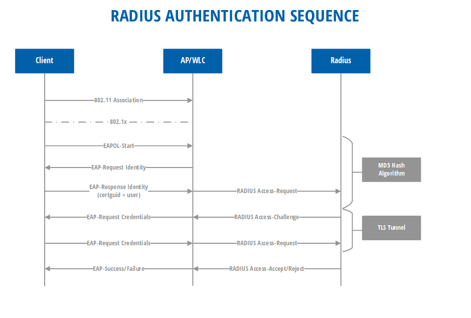

# Security & Privacy

## Data Processing and Permissions

### 1. From what data center is RADIUSaaS operating?

RADIUSaaS' core service can currently be deployed in the following regions:

* Australia
* Europe
* United Kingdom
* United States of America

In case RADIUS proxies are required, they can be deployed in the following countries/regions:



### 2. Which data is processed by RADIUSaaS?

#### **Certificates**

RADIUSaaS processes X.509 user or device certificates to validate the authenticity of the authentication request. As part of the certificate, every attribute can be processed, potentially containing information such as:

* Username
* Email
* UPN

#### **RADIUS Protocol**

RADIUSaaS relies on the RADIUS protocol, e.g. the following data is visible to RADIUSaaS:

* Client MAC address
* NAS (e.g. access point, switch, ...) MAC address
* WiFi SSID
* Vendor-specific data (e.g. VLAN, tunneling-group, ...)
* NAS IP address
* ISP-assigned public IP address
* RADIUS Shared Secret (only relevant if RadSec is not natively supported)
* Private key of the RADIUS server certificate

#### **Miscellaneous**

RADIUSaaS (optionally) provides functionality to generate username + password pairs for network access. Those credentials are stored and processed by the service as well.

### 3. Which data is persistently stored by/on behalf of RADIUSaaS and how?

1.  Permissions

    The RADIUSaaS platform stores UPN/email information on the users that are allowed to access the platform. **No passwords are stored or processed by RADIUSaaS.**
2.  Logging

    For troubleshooting and analysis purposes, the RADIUSaaS platform logs all relevant data it processes (see [Question 2](./#2.-which-data-is-processed-by-radiusaas) except for the RADIUS Shared Secret and the private key of the server certificate).

    The logs are stored directly on the RADIUSaaS platform within an _Elasticsearch_ database and segregated for every client via a dedicated space.\
    \
    **Log retention time: 75 days.**
3.  Certificates

    RADIUSaaS requires several server certificates as well as root certificates to facilitate proper operation. All those certificates are securely **stored in an Azure KeyVault**.
4. The optional username + password credentials mentioned in [Question 2](./#2.-which-data-is-processed-by-radiusaas) are **stored in an Azure KeyVault**.
5.  Other secrets and configuration data

    Other secret data, e.g. the RADIUS Shared Secret as well as the service's configuration are securely **stored in an Azure KeyVault**.

### 4. Is there an archiving mechanism for logs?

There is no built-in log archiving mechanism. However, the [Log Exporter](../../../admin-portal/settings/log-exporter/) feature can be used to ingest RADIUS logs into your own logging and archiving services.

### 5. Which tenant permissions do users accessing the RADIUSaaS web portal have to consent to?

1.  `Basic User Profile`:

    With this permission RADIUSaaS retrieves the user's UPN that tries to log on to the RADIUSaaS Admin Portal.
2.  `Maintain access to data you have given it access to`

    With this permission RADIUSaaS receives the right to request a refresh token so that the user can stay logged-on.

Please see [here](../../../admin-portal/settings/permissions.md#permissions-consent) for details.

### 6. What data is made available by granting the consent(s) from 5.?

1.  `Basic User Profile`:

    For details on what data can be retrieved, please refer to this article: [https://docs.microsoft.com/en-us/azure/active-directory/develop/v2-permissions-and-consent#profile](https://docs.microsoft.com/en-us/azure/active-directory/develop/v2-permissions-and-consent#profile)&#x20;
2.  `Maintain access to data you have given it access to`

    No specific data is made available by granting consent to this permission.

### 7. Which externally accessible endpoints does RADIUSaaS expose?

1. RADIUS Server Backend API
   * Provides configuration information to the RadSec proxy.
2. RADIUS and RadSec Server Ports
   * To facilitate network authentication from anywhere on the internet, these authentication interfaces have to be publicly exposed.
3. RADIUSaaS Admin Portal
   * A web portal which facilitates the administration of the service.
4. Kubernetes Cluster Management API
   * Required to operate the service.

### 8. How are the endpoints from Question 7 protected?

1. RADIUS Server Backend API
   * Secured via JWT access tokens that can be managed (issued, deleted, revoked) by the customer.
2. RADIUS Proxy and RadSec Server Ports
   * RadSec server ports: TLS-secured (>= version 1.2).
   * RADIUS proxy server ports: Protected via the RADIUS Shared Secret.
3. RADIUSaaS Admin Portal
   * Secured via OAuth 2.0 authentication against one of our [supported IDPs](../../../admin-portal/settings/permissions.md#supported-idps).
4. Kubernetes Cluster Management API
   * TLS-secured (>= version 1.2).

### 9. What ports and protocols are used by the endpoints from Question 7?

* RADIUS Server Backend API
  * HTTPS (TCP / 443)
* RADIUS Proxy and RadSec Server Ports
  * RadSec server ports: RadSec (TCP / 2083)
  * RADIUS proxy server ports: RADIUS (UDP / 1812, 1813)
* RADIUSaaS Admin Portal
  * HTTPS (TCP / 443)
* Kubernetes Cluster Management API
  * HTTPS (TCP / 443)

## Identity

### 1. What authorization schemes are used to gain access to RADIUSaaS?

* Administrative access is realized through OAuth 2.0 authentication against an [IDP](../../../admin-portal/settings/permissions.md#supported-idps) for identities or accounts that are registered on the platform.

### 2. Are there conditional access / role-based access controls in place to protect RADIUSaaS?

* Yes. The RADIUSaaS Admin portal provides features to assign roles to every user (available roles: administrator, viewer, guest).
* In order to properly operate and maintain the service, there are super-admin accounts for a limited circle of glueckkanja AG employees, that have full access to all client instances of the RADIUSaaS service.

### 3. Can access credentials be recovered? If yes, how?

* Login credentials: Depends on the configured Microsoft Entra ID (Azure AD) policies in the customer tenant.
* Username + password credentials as well as all certificates for network access can be recovered from Azure KeyVault with a retention policy of 90 days after they have been deleted.

## Data Protection

### 1. How is _data at-rest_ protected against unauthorized access?

#### **Configuration Data and Secrets**

* Configuration data is stored in Azure KeyVault and protected via access credentials that are in turn stored as _Kubernetes Secrets_.

#### **Kubernetes Service**

* The volumes and disks used to host our service are [encrypted](https://learn.microsoft.com/en-us/azure/aks/enable-host-encryption).

#### **Logs**

* The Elasticsearch Database is hosted on the encrypted Kubernetes Service disks.
* The logs are stored in an Elasticsearch Database and segregated via dedicated spaces.
* Access to those spaces is given via username + password credentials that are in turn stored as _Kubernetes Secrets_.
* The Elasticsearch Database itself is not encrypted.

### 2. How is _data in transit_ protected against unauthorized access?

* The authentication flows of the device trying to access the network are wrapped into a TLS-tunnel (>= TLS 1.2).
* The association between NAS and the RADIUS server is obfuscated via the RADIUS Shared Secret (MD5 hash algorithm).

### 3. How are customer tenants separated from each other?

#### Backend

RADIUSaaS backend services run on multiple Kubernetes clusters that are distributed worldwide. Every customer's RADIUSaaS instance has their own K8s namespace, logging space and dedicated public IP. There is an Elasticsearch instance with dedicated customer accounts for logging and reading per cluster.

#### RADIUS proxies

Every RADIUSaaS proxy runs on its own VM with dedicated public IP.

## Security by Design

### 1. Does RADIUSaaS employ a defense in depth strategy?

RADIUSaaS relies on well-established protocols to handle network authentication flows (RADIUS, RadSec, EAP-TLS, EAP-TTLS-X). Due to the strong focus on certificate-based authentication, capturing the traffic is meaningless as long as the eavesdropper does not have access to a trusted certificate.

### 2. Is the UDP-based RADIUS protocol secure?

We are recommending to use the modern [RadSec](../../../details.md#what-is-radsec) protocol to authentication against RADIUSaaS. However, there are many network infrastructure components still out there, which do not support RadSec.

The following diagram shows the RADIUS authentication flow:

In the first part of the authentication sequence, the communication is secured by an MD5-based hashing algorithm (partially encrypted with the shared secret). **No secrets** are transported in this phase.

In the second part of the authentication sequence, a TLS-based EAP (e.g. EAP-TLS) encrypts the traffic. The EAP-TLS traffic is then transported via UDP to the RADIUS proxy. This is the phase when credentials such as the certificate or the password is exchanged with RADIUSaaS. If you use certificate-based authentication, no secrets are transported in this phase as only the public key is exchanged. The private key remains on the client device at all times.

A comprehensive comparison between RADIUS and RadSec in terms of transport security is provided [here](transport-security-in-radius-vs.-radsec.md).


Conclusion: UDP-based RADIUS authentication with RADIUSaaS is secure, since&#x20;

* the relevant traffic is encrypted\
  and
* additionally there are no secrets transported, if certificate-based authentication is used.


### 3. What technologies, stacks, platforms were used to design RADIUSaaS?

* `Kubernetes`
* `EFK Stack (Elasticsearch, Filebeats, Kibana)`
* `Python`
* `Azure (KeyVault)`
* `TerraForm`
* `Git CI`

## GDPR and Data-residency 

### 1. Is data leaving Europe?

* Core Services: Depends on configuration
  * RADIUSaaS's core services can be hosted in the data centers described in [Question 1](./#1.-from-what-data-center-is-radiusaas-operating).
  * If the service is hosted in a European data center, then no data leaves the European Union.
* RadSec Proxy: Depends on configuration
  * If you require a RadSec proxy due to limitations of the network gear in regards to native RadSec support, you may select a proxy from various regions, Europe amongst others. In that case, your data stays within the borders of the European Union.

### 2. What 3rd-Party cloud-providers does RADIUSaaS rely on and why?

| Company                                        | Services                                                         | Contact                                                                                   | Purpose                                                         |
| ---------------------------------------------- | ---------------------------------------------------------------- | ----------------------------------------------------------------------------------------- | --------------------------------------------------------------- |
| Microsoft Corporation                          | Cloud Services (Azure)                                           | 
Building 3, Carmanhall Road Sandyford, Industrial Estate 18, Dublin, Ireland
 | Kubernetes Service, networking, storage                         |
| Digital Ocean, Inc.                            | Cloud Services                                                   | 
Y101 6th Ave, New York City, NY 10013, United States
                      | Kubernetes Service, networking, storage, VMs for RADIUS proxies |
| Vultr (trademark of The Constant Company, LLC) | Cloud Services                                                   | 
319 Clematis Street - Suite 900 West Palm Beach, FL 33401, United States
     | VMs for RADIUS proxies                                          |
| GitLab, Inc.                                   | git code repository, integration, testing and release automation | 
268 Bush Street #350, 

San Francisco, 

CA 94104-3503, United States 
   | Code repository, CI/CD pipeline.                                |

## Miscellaneous 

### 1. Is RADIUSaaS part of a bug-bounty program?

No

### 2. What QA measures are in place?

* There are dedicated RADIUSaaS labs for development purposes
* The deployment and installation of the service is realized through TerraForm, ensuring consistency and idempotence of each instance deployment
* Kibana APM is used for service health measurement and alert management
* Digital Ocean monitoring supervising the RadSec proxies
* Each production release must go through the internal channel first, passing the relevant QA hurdles as part of our CI process
  * Unit tests
  * Peer review (six-eye-principle)
  * Integration tests
  * Stress tests
  * Experience-based testing

### 3. Do you regularly perform penetration tests?

No.

As part of our Secure Development Practices, we employ tools (e.g. static code analysis) that scan the code base for CVEs and other common exploits (including dependencies such as 3rd party libraries) that could impact the security of the endpoints RADIUSaaS exposes. Before any release, any relevant findings are assessed and remediated, to ensure RADIUSaaS remains free from any known vulnerabilities. We neither perform penetration tests ourselves, nor do we use 3rd party "Penetration Test-as-a-Service" tools. For the former, we see an inherent conflict of interest. For the latter, since typical penetration test services often simply check the exposed endpoints against CVEs and other known exploits, we do not see any added value to the checks we already perform using static code analysis. If you wish to perform your own penetration tests, please [reach out to us](https://support.radiusaas.com/support/tickets/new?ticket_form=technical_support_request_%28radiusaas%29) and tell us about your requirements.

### 4. Is there a patching process in place?

Yes.&#x20;

Patches, hot-fixes, bugfixes and feature updates are introduced using our CI/CD process that leverages different testing pipelines to ensure that only code that satisfies our QA hurdles gets released. Newly released code is automatically made available to all our customers. Using Infrastructure as Code (Terraform) enables us to deliver consistent, reproducible and high-quality updates to our customers.

The Kubernetes-based architecture of our service ensures that code updates are seamless for our customers and do not lead to any service outages.&#x20;

### 5. What are the SLAs for patches?

* Patches for CVEs / security vulnerabilities: Once the vulnerability becomes public knowledge or as soon as we identify a vulnerability within our own code, a hot-fix will be provided no longer than 24 hours after we have become aware of the vulnerability.&#x20;
* Other patches: No SLA.

### 6. Does RADIUSaaS perform backups?

#### Secrets and configuration data

We leverage Azure KeyVault to securely store secrets (e.g. certificates) and all other configuration data of the service. Azure KeyVault is a highly-available [geo-redundant service](https://learn.microsoft.com/en-us/azure/key-vault/general/disaster-recovery-guidance) that replicates all of its content in a second datacenter, thus providing implicit back-up services.&#x20;

#### RADIUS and RadSec servers

Stateless. No back-up required.

#### Logs

Currently not backed-up.

### 7. Are there backup restore tests?

Yes.&#x20;

The restoration from back-ups is tested with every update/release of the service. There are approximately 4 - 8 releases per year.

