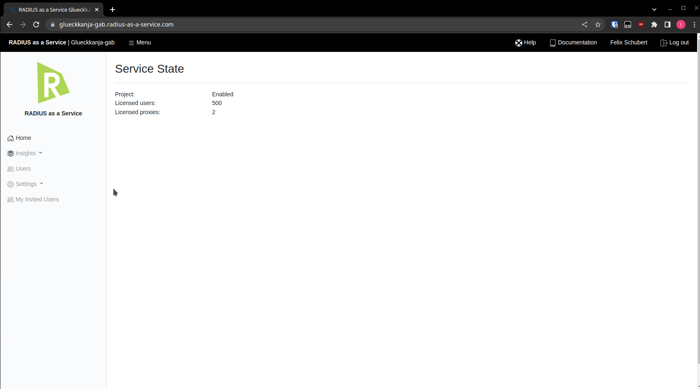

# XML

Today, most MDM platforms provide a wizard-based method to deploy networking profiles (WiFi and LAN). If this is not possible, or if the wizard provides only limited configuration options, you may generate a raw-XML directly on the RADIUSaaS platform.

## WiFi & LAN

To generate your XML, collapse the **XML** section, enter your **SSID** and click **Download**.

