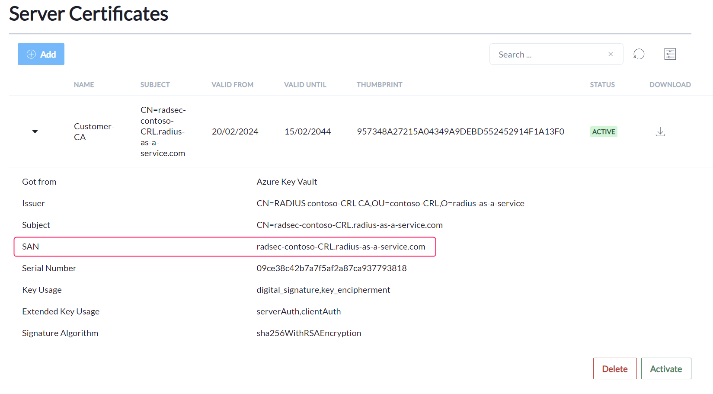

# iOS/iPadOS & macOS

## Configuration steps

1. Log in to [Microsoft Intune](https://intune.microsoft.com/)
2. Navigate to **Devices** and subsequently **Configuration profiles**
3. Then click **Create > New policy**
4. As **Platform** select **iOS/iPadOS** or **macOS**
5. Search the **Profile type** templates for **Wi-Fi** and select it
6. As **Profile type** select **Wi-Fi**
7. Click **Create** and provide a descriptive name and optional **Description**
8. As **Wi-Fi type** select **Enterprise**
9. Enter your **SSID**. The **Network name** can assume the same name.
10. Select the applicable **Security type** (iOS/iPadOS only)
11. Then for **EAP type** choose **EAP - TLS**
12. Next, as **Certificate server names** add the&#x20;

    * **Subject Alternative Name (SAN)**
    * and **Common Name (CN)**&#x20;

    of your _active_ RADIUS [**Server Certificate.**](../../../admin-portal/settings/settings-server.md#server-certificates) Those properties can be found by expanding the active server certificate and copying the relevant values. **Please consider, that the common name is case-sensitive.** \

    <figure><figcaption></figcaption></figure>
13. For the **Root certificates for server validation** select the Trusted certificate profile you have previously created for the RADIUS Server Certificate.
14. Under **Client Authentication** select **Certificates** as **Authentication method**&#x20;
15. Finally, under **Certificates** select the SCEP profile you would like to use for authentication.

All other settings can be configured according to your own needs and preferences.

<figure><figcaption>
Showing iOS/iPad Wi-Fi Profile
</figcaption></figure>

## Common configuration issues

See [Troubleshooting](../../../other/trubleshooting.md#intune-configuration-issues).
