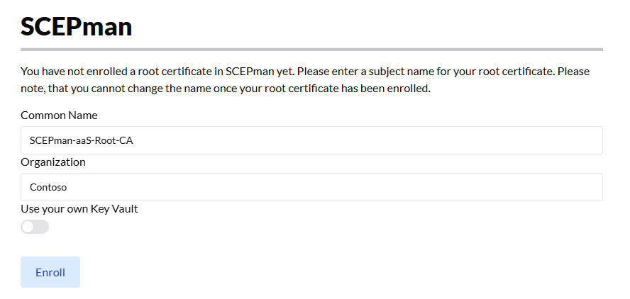
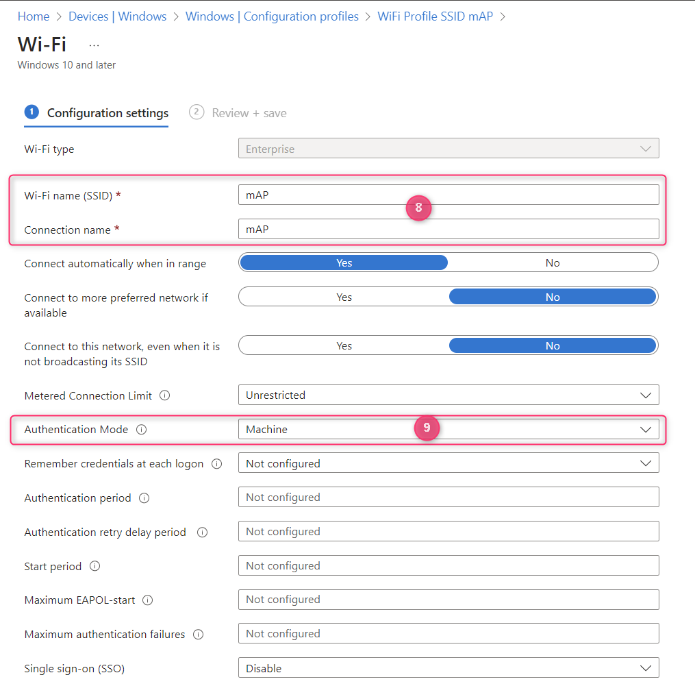

# Windows

## Configuration steps

1. Log in to [Microsoft Intune](https://intune.microsoft.com/)
2. Navigate to **Devices** and subsequently **Configuration profiles**
3. Then click **Create > New policy**
4. As **Platform** select **Windows 10 and later**
5. Search the **Profile type** templates for **Wi-Fi** and select it
6. Click **Create** and provide a descriptive name and optional **Description**
7. As **Wi-Fi type** select **Enterprise**
8. Enter your **SSID**. The **Connection Name** can assume the same name.
9. Configure the **Authentication Method** to **User** if you want to use user-type certificates for authentication or **Machine** if you would like to use device-type certificates for authentication.
10. Then for **EAP type** choose **EAP - TLS**
11. Next, as **Certificate server names** add the&#x20;

    * **Subject Alternative Name (SAN)**
    * and **Common Name (CN)** (only the value, without _CN=_)

    of your _active_ RADIUS [**Server Certificate**](../../../admin-portal/settings/settings-server.md#server-certificates). Those properties can be found by expanding the active server certificate and copying the relevant values. \
    If the SAN and the CN values are identical, you need to add the server name only once.

<figure><figcaption></figcaption></figure>


Please consider, that the common name is case-sensitive.


12. For the **Root certificates for server validation** select the Trusted certificate profile you have previously created for the RADIUS Server Certificate.
13. Under **Client Authentication** select **SCEP certificate as** **Authentication method**&#x20;
14. Finally, **Client certificate for client authentication (Identity certificate)** select the SCEP profile you would like to use for authentication.

    All other settings can be configured according to your own needs and preferences.

<figure><figcaption>
Showing Wi-Fi profile configuration 1/2
</figcaption></figure>

<figure><figcaption></figcaption></figure>

### Fast roaming


These are **optional** settings.


For a (usually) better experience when roaming between access points, we recommend enabling the following **Fast roaming settings** in the WiFi profile:

| **Enable pairwise master key (PMK) caching** | Yes | Defines whether Pairwise Master Key (PMK) caching is to be used by this profile to connect to a WLAN. |
| -------------------------------------------- | --- | ----------------------------------------------------------------------------------------------------- |
| **Maximum time a PMK is stored in cach**     | 720 | Defines the length of time, in minutes, that a Pairwise Master Key (PMK) cache will be kept.          |
| **Maximum number of PMK's stored in cache**  | 128 | Defines the number of entries in the Pairwise Master Key (PMK) cache on the client.                   |
| **Enable pre-authentication**                | Yes | Defines whether pre-authentication will be used by the client                                         |
| **Maximum pre-authentication attempts**      | 3   | Defines the number of pre-authentication attempts to try on neighboring access points (AP)            |

For further details on Pairwise Master Key caching, please refer to its specification in [IEEE 802.11i](https://standards.ieee.org/getieee802/download/802.11i-2004.pdf).

**Important**: The reliability and effectiveness of this feature may also depend on the specific implementation by the WAP vendor. In the same cases, customers with PMK caching enabled, have reported frequent access-point toggling although the device's location was static.

## Common configuration issues

See [Troubleshooting](../../../other/trubleshooting.md#intune-configuration-issues).
