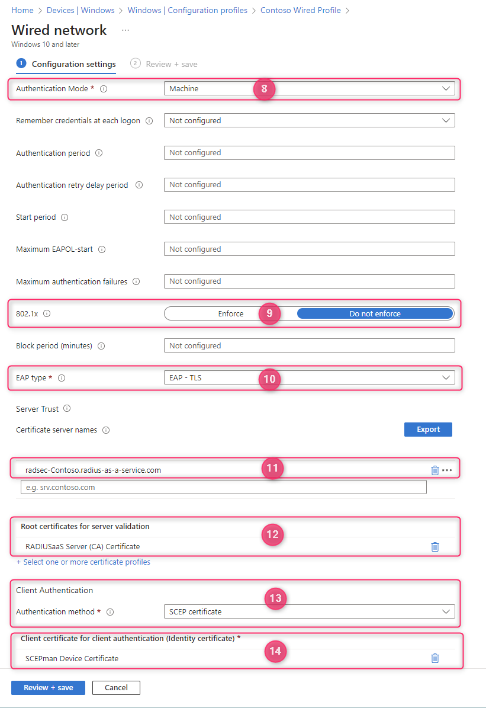

# Windows

## Configurations steps

1. Log in to [Microsoft Intune](https://intune.microsoft.com/)
2. Navigate to **Devices** and subsequently **Configuration profiles**
3. Then click **Create > New policy**
4. As **Platform** select **Windows 10 and later**
5. Search the **Profile type** templates for **Wired network** and select it
6. Click **Create** and provide a descriptive name and optional **Description**
7. fill out the **Configuration settings** as it suits your environment
8. Configure the **Authentication Method** to **User** if you want to use user-type certificates for authentication or **Machine** if you would like to use device-type certificates for authentication.
9. Under **802.1X** make sure, that **Do not enforce** is selected. This way your network adapter will continue to work in environments (e.g. home office), where 802.1X is not available.
10. For **EAP Type** choose **EAP-TLS**
11. Next, as **Certificate server names** add the&#x20;

    * **Subject Alternative Name (SAN)**
    * and **Common Name (CN)**&#x20;

    of your _active_ RADIUS [**Server Certificate.**](../../../admin-portal/settings/settings-server.md#server-certificates) Those properties can be found by expanding the active server certificate and copying the relevant values. **Please consider, that the common name is case-sensitive.**&#x20;

    <figure><figcaption></figcaption></figure>
12. For the **Root certificates for server validation** select the Trusted certificate profile you have previously created for the RADIUS Server Certificate.
13. Under **Client Authentication** select **SCEP certificate** as **Authentication method**&#x20;
14. Finally, **Client certificate for client authentication (Identity certificate)** select the SCEP profile you would like to use for authentication.

All other settings can be configured according to your own needs and preferences.

