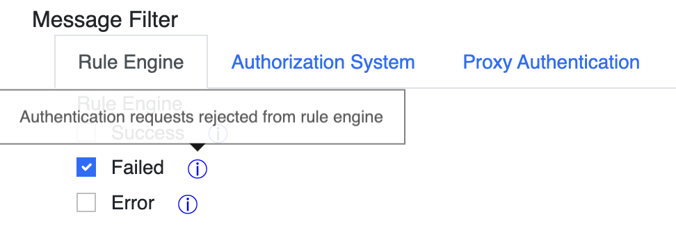

# Juniper Mist

## Prepare Certificates

1. **Download** the root certificate of the CA that has issued your RADIUS server certificate as described [here](../../../portal/settings/settings-server/certificates.md#download).
2. **Create** a client certificate for your Access Points. If you are using **SCEPman Certificate Master**, the process is described here: [https://docs.scepman.com/certificate-deployment/certificate-master/client-certificate-pkcs-12](https://docs.scepman.com/certificate-deployment/certificate-master/client-certificate-pkcs-12)
3. **Add** the root certificate of the CA that has issued the client certificate on your Access Point to your RADIUS instance as described [here](../../../portal/settings/settings-server/certificates.md#radsec-connection-certificates).

## Mist Configuration


Below settings are the necessary settings to establish a functional RadSec connection with our service. Configure any other settings at your discretion.


1. Navigate to your Mist configuration plane
2.  To configure the relevant certificates, navigate to **Organization** --> **Settings**

    <figure><figcaption></figcaption></figure>
3.  **Add** the root certificate of the CA that has issued your RADIUS server certificate under **RadSec Certificate**

    <figure><figcaption></figcaption></figure>

4.  **Add** your Access Point **client certificate** (created in step 2 of [Prepare Certificates](juniper-mist.md#prepare-certificates)) to **AP RadSec Certificate**

    <figure><figcaption></figcaption></figure>
5.  Go to **Site** --> **WLANs**

    <figure><figcaption></figcaption></figure>
6. **Create** a new WLAN if you have not already created one for which you want to leverage RADIUS authentication against our service.
7.  Select **Enterprise (802.1X)** as **Security Type**

    <figure><figcaption></figcaption></figure>
8.  Under **RadSec**, select **Enabled** and set the **Server Name** to the **SAN** attribute of your RADIUS Server certificate

    <figure><figcaption></figcaption></figure>
9.  For **Server Addresses** use either the [**IP address**](../../../portal/settings/settings-server/ports-and-ip-addresses.md) or the [**DNS** **name**](../../../portal/settings/settings-server/ports-and-ip-addresses.md) of your RadSec service endpoint.

    <figure><figcaption></figcaption></figure>

### A complete Run-Through

<figure><figcaption></figcaption></figure>
