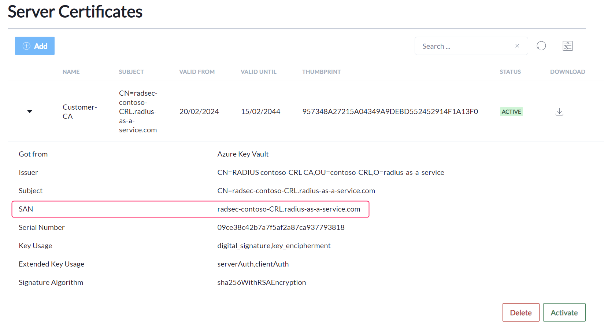

# Juniper Mist

## Prepare certificates

1. Download the Root certificate of your RADIUS Server as described here: [#download](../../../portal/settings/settings-server/certificates.md#download "mention")
2. Create a client certificate for your Access Points. If you have SCEPman Certificate master, the process is described here: [https://docs.scepman.com/certificate-deployment/certificate-master/client-certificate-pkcs-12](https://docs.scepman.com/certificate-deployment/certificate-master/client-certificate-pkcs-12)
3. Add the Root certificate of the CA where your APs get their certificates from, to your RADIUS instance as described here: [#radsec-connection-certificates](../../../portal/settings/settings-server/certificates.md#radsec-connection-certificates "mention")

## Mist configuration


You can choose any other setting on your behalf. Described are the necessary settings you need to make.


1. Go to your Mist configuration plane
2.  To configure the certificates go to **Organization** -> **Settings**

    <figure><figcaption></figcaption></figure>

3.  Add your RADIUS Root certificate under **RadSec Certificates**

    <figure><figcaption></figcaption></figure>

4.  Add your Access Point certificate (created in step 2 of[#prepare-certificates](juniper-mist.md#prepare-certificates "mention")) to **AP RadSec Certificate**

    <figure><figcaption></figcaption></figure>
5.  Go to **Site** -> **WLANs**

    <figure><figcaption></figcaption></figure>
6. Create a new WLAN if you not already have one where you want to authenticate your users against RaaS&#x20;
7.  Select **Enterprise (802.1X)** as security Type

    <figure><figcaption></figcaption></figure>
8.  Under **RadSec**, select **Enabled** and set the **Server Name** to the SAN attribute of your RADIUS Server certificate

    <figure><figcaption></figcaption></figure>
9.  For **Server Addresses** use either the **IP** or the **DNS** Name of your RadSec server

    <figure><figcaption></figcaption></figure>

****

### A complete run through

<figure><figcaption></figcaption></figure>

##
