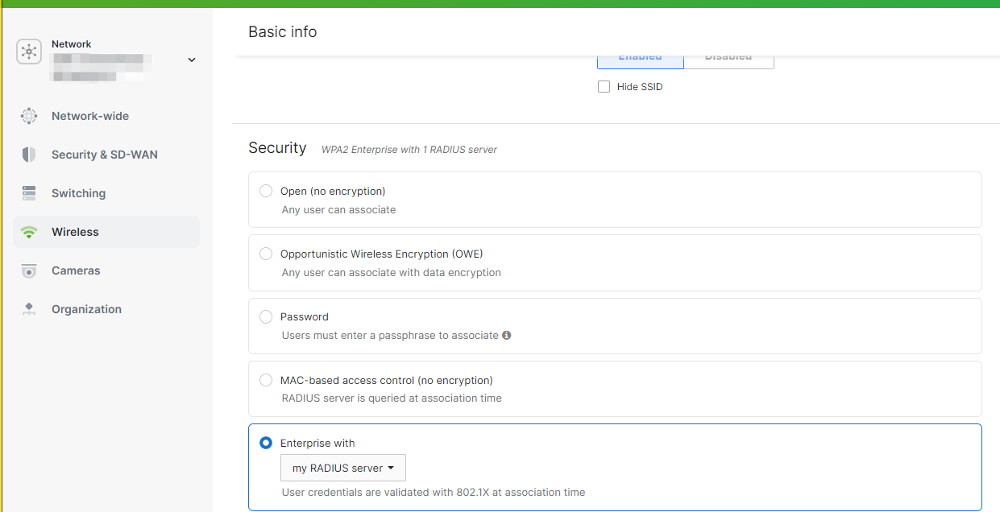
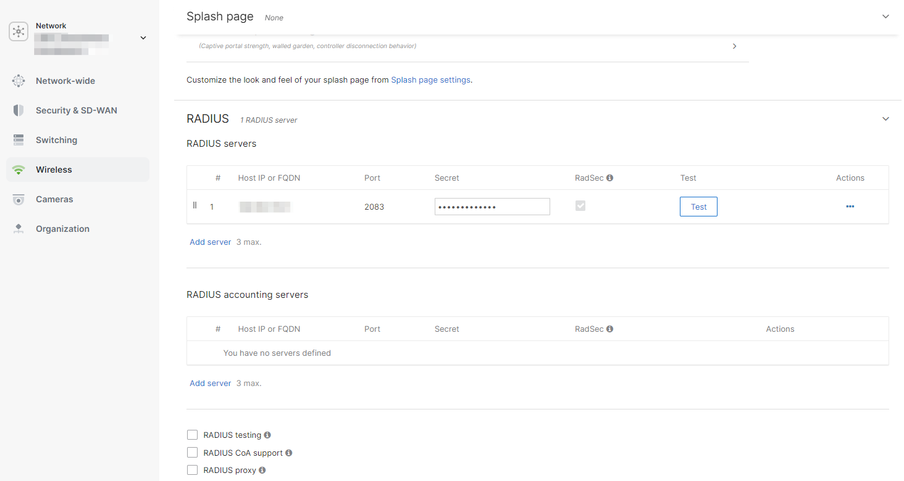
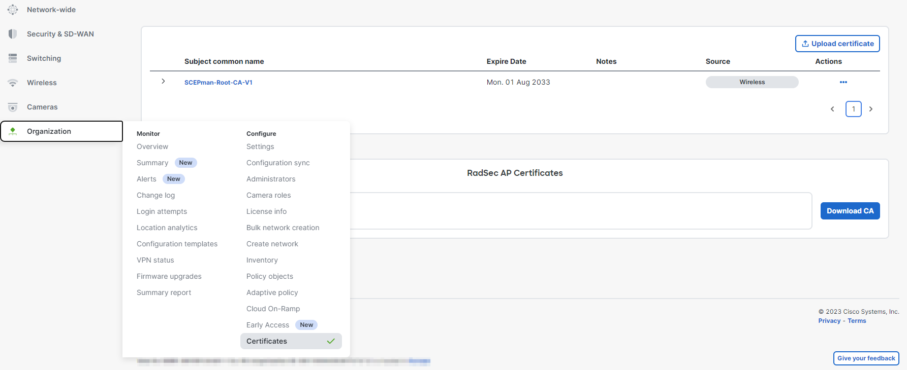
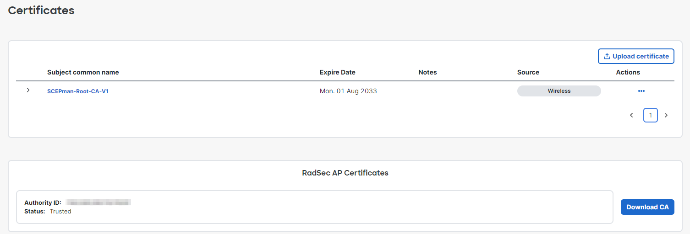

# Meraki


To use the RadSec feature on your Meraki APs, firmware version **MR 30.X** or later is required.


## Prepare Certificates


The Meraki platform does not allow you to generate RadSec client certificates from a CA of your choice. Instead, you must use Meraki's built-in **Organization CA** that is unique to your Meraki Organization.


1. **Download** the root certificate of the CA that has issued your RADIUS server certificate as described [here](../../../portal/settings/settings-server/certificates.md#download).

## Meraki Configuration


Below settings are the necessary settings to establish a functional RadSec connection with our service. Configure any other settings at your discretion.


1. Navigate to your **Meraki Dashboard**
2. Select **Wireless > Access control**
3.  Ensure you have switched to the **new UI version** of the Access control site\

    <figure><figcaption></figcaption></figure>
4. Select the **SSID** you wish to configure RADIUS authentication for (or navigate to **Wireless > Configure > SSIDs** to create a new SSID first).
5.  In the **Security** section, select **Enterprise with** and in the dropdown **my RADIUS server**\

    <figure><figcaption></figcaption></figure>
6.  Under **RADIUS**, click **Add server**. Configure the **IP address** to match the [**RadSec IP**](../../../portal/settings/settings-server/ports-and-ip-addresses.md#radsec-ip-address-tcp) address of your RADIUSaaS instance, set the **Port** to 2083 and copy the [**Shared secret**](../../../portal/settings/settings-server/ports-and-ip-addresses.md#shared-secrets) and activate the **RadSec** checkbox.\

    <figure><figcaption></figcaption></figure>
7. Click **Save**
8.  To upload and generate the required certificates, navigate to **Organization > Certificates**. In the top table, click **Upload certificate** and provide the root certificate of the CA that has signed your [RADIUS server certificate](../../../portal/settings/settings-server/certificates.md#download), e.g. SCEPman. Your Meraki APs now trust your RADIUS server.\

    <figure><figcaption></figcaption></figure>
9. Under **RadSec AP Certificates**, first create an **Organization CA** by clicking **Generate CA**. This CA is unique to your Meraki Organization.
10. Subsequently, trust that **Organization CA**. The Meraki platform will now automatically generate RadSec client certificates for all your APs signed by this CA. The lifetime of the certificate is very long (> 50 years), i.e. you do not have to worry about renewing them.\

    <figure><figcaption></figcaption></figure>
11. Eventually, establish trust between the APs and your RADIUSaaS platform. Therefore, download the root CA certificate of your **Organization CA** by clicking **Download CA**. Now, upload the downloaded CA certificate to your trusted [**RadSec Connection Certificates**](../../../portal/settings/settings-server/certificates.md#add-a-new-certificate).

## Links

Link to Meraki's documentation for the RadSec configuration: [https://documentation.meraki.com/MR/Encryption\_and\_Authentication/MR\_RADSec](https://documentation.meraki.com/MR/Encryption\_and\_Authentication/MR\_RADSec)
