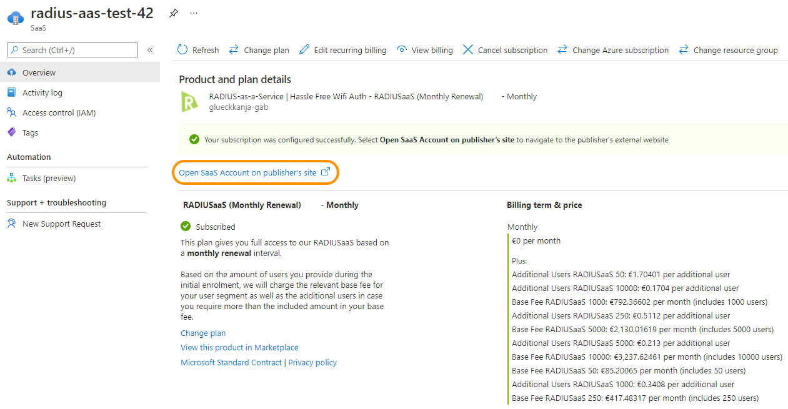
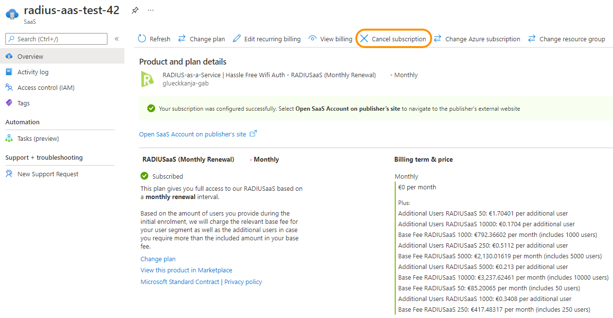

# Licensing

## General

The subscription license for RADIUSaaS is user-based. _User_ is defined as a person who is assigned to at least one device that is enabled to authenticate towards a network via RADIUSaaS. One single _User_ may be assigned to up to five stationary devices **and** five mobile devices (5+5).

#### Limitations

* The **minimum amount** of users that can be licensed is **50**.

### Subscription Scope

A RADIUSaaS subscription may be used for the clients and users of **one** organization.&#x20;

It is **not** allowed to&#x20;

* Use one RADIUSaaS subscription for multiple organizations
* Split one RADIUSaaS subscription and/or re-sell it to multiple organizations

## Azure Marketplace

### Pricing Model

* Every plan consists of a **base fee** which includes a certain amount of users per month or per year (depending on the renewal interval of the plan). For example, the **base fee** of _RADIUSaaS 50 (M)_ includes 50 users per month.
* If more than the included amount of users is required, **additional users** can be added to the  plan. For each additional user, we charge an additional monthly or annual per-user fee, depending on the renewal interval of the underlying plan.&#x20;
* The logic on our landing page will always choose the cheapest user segment based on your desired amount of total users. For example, if you require 300 users on a monthly basis, we will charge you with the _RADIUSaaS 250 (M)_ base fee **plus 50 additional users** in the segment _RADIUSaaS 250 (M)_.
* You will be prompted for your desired (additional) user count on our landing page during the subscription enrolment process.
* Upon initial subscription enrolment or during an intermediate subscription upgrade, our landing page will inform you about the licensing costs you have to expect to be charged with by Microsoft.&#x20;

### Invoicing

* During the first subscription interval, your subscription fees are not immediately due after completing the subscription enrolment. Instead we will report them to Microsoft after your cancellation grace period or trial period (whatever finishes last) expires.&#x20;
* Upon every renewal date, we will report your fees to Microsoft immediately.
* The related items should appear on your Microsoft invoice (PayAsYouGo) the month after we have reported your fees to Microsoft.

### Plan Overview

| **Plan**      | **Renewal Interval** |
| ------------- | -------------------- |
| RADIUSaaS (M) | Monthly              |
| RADIUSaaS (Y) | Annually             |

#### User Segments

All user segments are available for _RADIUSaaS (M)_ and _RADIUSaaS (Y)._ The annual plan is discounted by 10% in comparison to the monthly plan (calculated over the period of 12 months).

| **User Segment**      | **Included Users in Base Fee** | **Maximum Total User** |
| --------------------- | ------------------------------ | ---------------------- |
| RADIUSaaS (M/Y) 50    | 50                             | 249                    |
| RADIUSaaS (M/Y) 250   | 250                            | 999                    |
| RADIUSaaS (M/Y) 1000  | 1,000                          | 4,999                  |
| RADIUSaaS (M/Y) 5000  | 5,000                          | 9,999                  |
| RADIUSaaS (M/Y) 10000 | 10,000                         | unlimited              |

For prices in Euro (EUR), please check out our <mark style="color:green;"></mark> [website](https://www.radius-as-a-service.com/pricing/). For prices in _your_ currency, please directly refer to the Azure Marketplace in your [Azure Portal](https://portal.azure.com).

### User Up- and Downgrades

#### Upgrades

* If you would like to upgrade your user count, you can do that any time during the current subscription cycle by navigating to your **RADIUSaaS subscription** in the [Azure SaaS portal](https://portal.azure.com/#blade/HubsExtension/BrowseResourceBlade/resourceType/Microsoft.SaaS%2Fresources) <mark style="color:green;"></mark> and by clicking on "Open SaaS Account on publisher's site" (see screenshot below). This will re-direct you to our landing page where the amount of users can be upgraded.
* In case the upgrade occurs within the current subscription interval, only the prorated amount of fees incurred by the additional users will be reported to Microsoft for this interval.
* Our landing page will inform you about the new fees for a **complete** subscription cycle.
* After confirming your choice and once we have updated the license in our backend, you will receive a confirmation email from us.

#### Downgrades

* Downgrading the amount of users is currently not possible without cancelling the subscription.
* If you want to perform a downgrade, please cancel your current subscription from your <mark style="color:green;"></mark> [Azure SaaS portal](https://portal.azure.com/#blade/HubsExtension/BrowseResourceBlade/resourceType/Microsoft.SaaS%2Fresources) towards the end of the current cycle by clicking "Cancel subscription" (see screenshot below) and re-subscribe to your desired plan with the desired user amount once the cancellation becomes effective.
* Please [get in contact with us](https://www.radius-as-a-service.com/help/) directly or send us an email to [sales@radiusaas.com](mailto:sales@radiusaas.com) <mark style="color:green;"></mark> **prior to the downgrade**, so we can update the license on your RADIUSaaS instance without having to de-commission it. This way, we can ensure an uninterrupted service of your RADIUSaaS instance during the user downgrade.

#### Change of Renewal Cycle

* Changing the renewal cycle is currently not possible without cancelling the subscription.
* If you want to change the renewal cycle, please cancel your current subscription from your <mark style="color:green;"></mark> [Azure SaaS portal](https://portal.azure.com/#blade/HubsExtension/BrowseResourceBlade/resourceType/Microsoft.SaaS%2Fresources) towards the end of the current cycle by clicking "Cancel subscription" (see screenshot above) and re-subscribe to your desired plan once the cancellation becomes effective.
* Please [get in contact with us](https://www.radius-as-a-service.com/drop-a-question) directly or send us an email to [sales@radiusaas.com](mailto:sales@radiusaas.com) <mark style="color:green;"></mark> **prior to the cycle change**, so we can update the license on your RADIUSaaS instance without having to de-commission it. This way, we can ensure an uninterrupted service of your RADIUSaaS instance during the user downgrade.

**Upon upgrades,  downgrades, and a change of the renewal cycle that was coordinated with us beforehand we will ensure that your service remains uninterrupted.**

### **Trials**

By default, when you purchase a plan from the Azure Marketplace, we will apply a 30-day trial period, for which we will not charge any subscription fees.&#x20;

This applies only to those customers who have never had a trial period before.

#### **Custom Trials**

In case you have special requirements or constraints that require more than 30 days of testing period, please [get in contact with us](https://www.radius-as-a-service.com/drop-a-question) directly or send us an email to [sales@radiusaas.com](mailto:sales@radiusaas.com) for an individual trial offer.

### How to Get Started

To get started with your RADIUSaaS subscription,

* Locate RADIUSaaS on the **Marketplace** in your [**Azure Portal**](https://portal.azure.com/#create/glueckkanja-gabag.radiusaas-transactable-prod/preview).

* Click "Set up + subscribe" and select your preferred plan based on the desired **renewal interval** (monthly or annual). We recommend to keep **Recurring billing** **on** so that you do not have to worry about a manual renewal of your subscription. Click "Review + subscribe" to deploy the subscription to your Azure SaaS.

.png>)


Please do not be confused by the random order of the add-ons. This is currently investigated by Microsoft. Later during the the enrolment process, we will provide you with transparent information on the expected licensing fees.


* Once you have successfully deployed the SaaS subscription into your Azure SaaS portal, please navigate to our subscription landing page by clicking "Configure account now"


You will only be charged by Microsoft, once you have completed the enrolment on our landing page. Until then the subscription will remain in status "Fulfillment pending".


* After authenticating on our landing page using your Microsoft credentials, you will be prompted for additional information, such as the desired User amount
* Based on the amount of Users provided on our landing page, we charge the relevant base fee for your User segment as well as additional Users, in case you require more than the included amount in your base fee.
* The landing page will show you the licensing fees you have to expect
* If you are happy with it, please complete the enrolment, which triggers us to set up your RADIUSaaS instance. We will inform you via email with all relevant information on the next steps once the instance is available for you. This won't take any longer than one business day.
