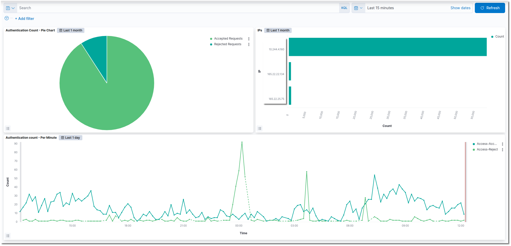

# 🆕 Insights

### Dashboards

In your Overview you have a short overview about the status for the logged in users over the day.&#x20;

### Authentications

Under Authentications you have tables to get a overview on how many times someone have been logged in and a overview about, why are authentications failing.&#x20;

.png>)

