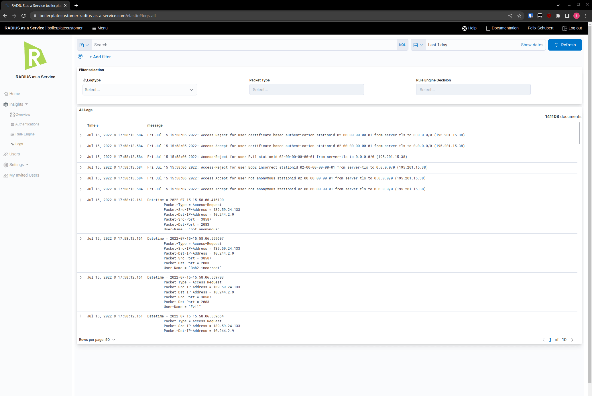

# Log

You can access basically every log which we get. That also means that you may not understand everything which you can read. You don't have to. If you have any questions, drop a message and we're happy to answer them.&#x20;

You can filter the Log to a general overview or to only see what is reaching your proxy for example.&#x20;

