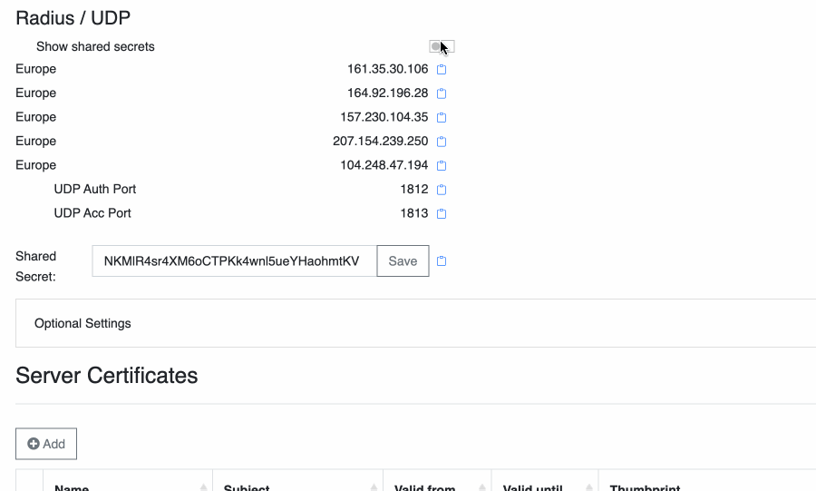

# Ports & IP Addresses

## Overview

RADIUSaaS provides public IP addresses that allow your network appliances and services to communicate with our service from anywhere via the internet. Thereby, we offer three flavors of IP addresses that support different protocols and listen on different ports.

## Universal IP Address (TCP + UDP)


Not available on all RADIUSaaS instances.


This type of public IP address **supports both** AAA protocols, **RADIUS** and **RadSec**. Consequently, it listens on port 1812, 1813 for RADIUS and on port 2083 for RadSec.

<figure><figcaption></figcaption></figure>

### Properties

#### RadSec DNS

The DNS entry through which the RadSec service can be reached.&#x20;

Please note that most network appliances do not support DNS-based RadSec addressing yet.

#### Server IP Addresses

Public IP address(s) on which the RadSec and RADIUS service is available.&#x20;

A second IP address is shown if we have configured a secondary RADIUSaaS instance for you.

#### Ports

This section displays the (standard) ports for the RadSec, RADIUS Authentication, and RADIUS Accounting services.

#### Shared Secret

The shard secret encrypts the RADIUS communication between your network gear and RADIUSaaS.

In case you want to use the RADIUS protocol on this IP address, the relevant shared secret can be configured in the **default shared secret text box** right above the **Optional Settings** section.

## RadSec IP Address (TCP)


Not available if the [Universal IP Address](ports-and-ip-addresses.md#universal-ip-address-tcp-+-udp) is available.


This type of public IP address supports the **RadSec protocol only**. Consequently, it listens on port 2083.

<figure><figcaption></figcaption></figure>

### Properties

#### RadSec DNS

The DNS entry through which the RadSec service can be reached.&#x20;

Please note that most network appliances do not support DNS-based RadSec addressing yet.

#### **Server IP Addresses**


These IP addresses only speak [RadSec](../../../details.md#what-is-radsec) over TCP port 2083!


Public IP address(s) on which the RadSec service is available.&#x20;

A second IP address is shown if we have configured a secondary RADIUSaaS instance for you.

#### Ports

This section displays the (standard) port for the RadSec.

## RADIUS IP Address (UDP)

This section is available when you have configured at least on [RADIUS Proxy](../settings-proxy.md). For each proxy, a separate public IP address is available. The public IP addresses in this section support the RADIUS protocol only and thus listen on ports 1812/1813.

<figure><figcaption></figcaption></figure>

### Properties

#### Server IP Addresses and Location


These IP addresses only speak [RADIUS](../../../details.md#what-is-radius) over UDP ports 1812/1813!


Geo-location of the RADIUS proxy/proxies as well as the respective public IP address(es).

#### Shared Secrets

By default **all RADIUS Proxies** use the same **default shared secret** as configured in the text box above the **Optional Settings** section. In case you would like to **individualize** the shared secrets for each proxy, enable **Show shared secrets** and configure the secrets as per your needs.

<figure><figcaption></figcaption></figure>

#### Ports

This section displays the (standard) ports for the RADIUS Authentication and RADIUS Accounting services.
