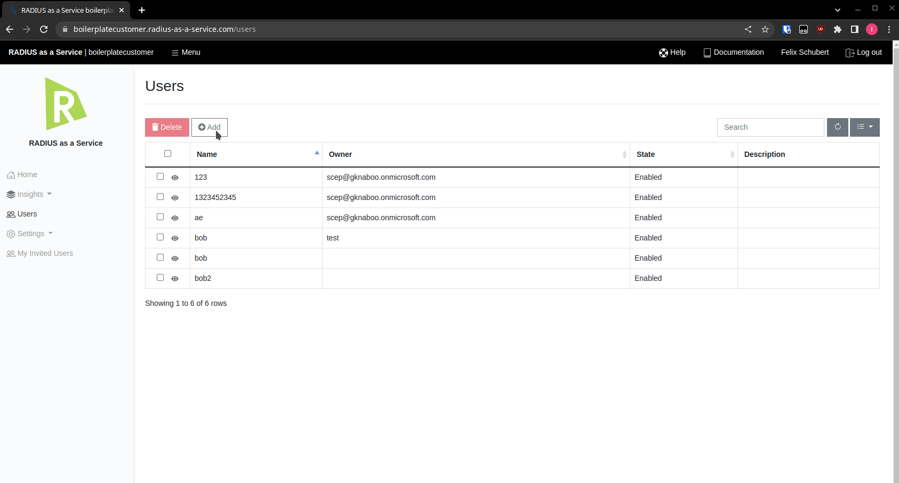

# Users

### Protocols

Devices that use **Username** and **Password** for network authentication have to speak one of the following Protocols:&#x20;

* EAP-TTLS-PAP
* EAP-TTLS-MSCHAPv2
* PEAP-MSCHAPv2

### Add a new User

Click **Add** and provide **User Name** and **Password** and choose your **Validity**. After entering all details, click  **Create**.

### CSV Import

To import your users from a CSV file

* Click on **Import(CSV)**

<figure><figcaption></figcaption></figure>

* A pop-up appears, from where you're able to upload your CSV file.&#x20;
* Once uploaded, the pop-up displays an interactive table mirroring the content of the CSV file
* In this table, you are able to manually override values at your discretion
* Click **Create** to import the User accounts.


The required columns are **Username, Password** and **Owner**



RADIUSaaS does not consider the **Username** a unique property. This means two or more **identical** **User** accounts may exist. Hence, if an error occurs while uploading the CSV file and users have already been created during the partial upload, please delete those users before uploading the CSV again to prevent duplicates.


<figure><figcaption></figcaption></figure>

### Delete

To **Delete** users, select all users which should be deleted in the list, click **Delete** and confirm your choice.

 (1).png>)

&#x20;

### Update

To change a user's password, disable/re-enable a user or select a new validity period, simply click on the **eye** symbol next to the user entry, change all needed entries and save them.

 (1).png>)
